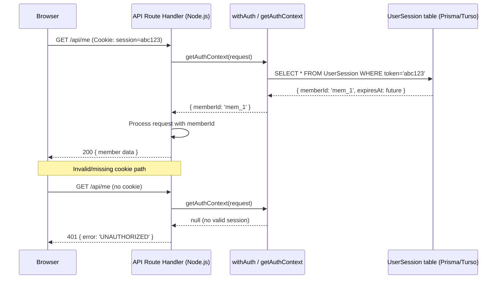
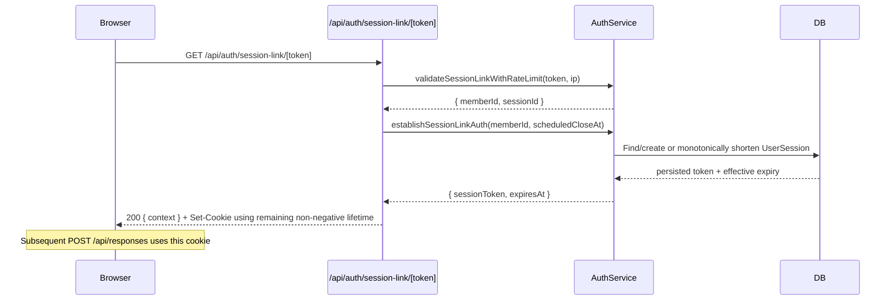
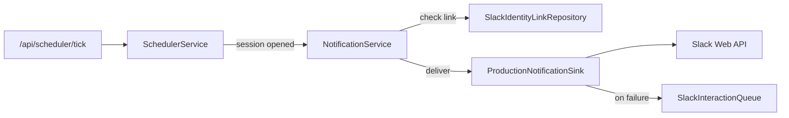

# Technical Design Document: Integration Hardening

## Overview

This spec closes the integration gaps between the Team Health Check application's individually-tested layers. The 811 passing unit/property tests prove each service works in isolation, but a browser-based walkthrough reveals the glue is missing: cookies aren't set, auth isn't enforced, response shapes don't match frontend expectations, and services that should be wired together (email, Slack, notifications) are not.

The changes are primarily wiring, reshaping, and hardening — not new business logic. The architecture (factory injection, repository pattern, thin route handlers) remains unchanged; we're completing the integration contracts it was designed for.

### Deployment Target

**Vercel + Turso** — consistent with the original Team Health Check design doc. Local development uses SQLite via better-sqlite3; production uses Turso (libSQL over HTTP) on Vercel serverless.

### Key Design Decisions

| Decision | Rationale |
|----------|-----------|
| Route-handler auth helper (`withAuth`) over Edge middleware | Vercel middleware runs on Edge Runtime where Prisma/Turso cannot execute. Route handlers run in Node.js — Prisma works there. |
| Cookie-based session over Authorization header | Browsers set cookies automatically; no client-side token management needed |
| Session-link sets a session cookie | Keeps one auth mechanism for all browser flows; session-link users can POST to /api/responses without dual-auth |
| Direct `AuthContext.memberId` identity | Protected browser routes pass the persisted-session member ID directly to authorization/services; caller-controlled identity headers are neither trusted nor synthesized |
| `SlackIdentityLinkRepository` interface | Replaces in-memory Map; consistent with existing repository pattern |
| EmailService injected into AuthService | Factory pattern already used; just add the dependency |
| NotificationService wired at scheduler route level | Consistent with existing pattern (scheduler is wired at route, not container) |
| Trends response reshaped at route level | Service returns raw data; route handler formats for frontend contract |
| Turso for production DB | Vercel has no persistent filesystem; Turso is SQLite-compatible serverless DB |

## Architecture

### Auth Flow (Post-Hardening)



#### Identity authority and intentional exemptions

For protected browser requests, `AuthContext.memberId` is the only identity
source. Route handlers pass it directly to team authorization and service
factories. They never trust or synthesize `x-member-id`, `x-user-id`,
`x-team-id`, or `x-session-id`; a caller cannot override cookie identity with a
header.

Cookie authentication is intentionally bypassed only where another credential
bootstraps or authenticates the request: magic-link tokens, session-link tokens,
genesis tokens, verified Slack signatures, and scheduler `CRON_SECRET`. These
routes validate that credential explicitly and do not convert identity headers
into authenticated context.

### Cookie Setting Flow

```mermaid
sequenceDiagram
    participant Browser
    participant VerifyRoute as /api/auth/magic-link/verify/[token]
    participant AuthService
    participant DB

    Browser->>VerifyRoute: GET /api/auth/magic-link/verify/abc
    VerifyRoute->>AuthService: verifyMagicLink('abc')
    AuthService->>DB: Claim token, create UserSession
    AuthService-->>VerifyRoute: { status: 'authenticated', sessionToken: 'xyz' }
    VerifyRoute-->>Browser: 200 + Set-Cookie: session=xyz; HttpOnly; SameSite=Lax; Max-Age=604800; [Secure if prod]
```

### Session-Link Cookie Setting Flow



### Schedule Configuration Audit Flow

The authenticated Delivery Manager identity is passed directly from the route to
`ScheduleService.configure(teamId, schedule, actorId)`. The service normalizes a
fixed six-field snapshot (`cadence`, open/close day and time, `timezone`), skips
persistence and audit for an equal snapshot, and otherwise appends one
`schedule_change` entry. First configuration uses `previousValue: "null"`;
updates serialize complete stable before/after snapshots. Schedule state, the
canonical Team timezone, and the audit append use one repository aggregate
operation: Prisma commits all three in one transaction, while the fake mirrors
Team timezone and does not mutate schedule state when the required audit fails.

### Slack Account Linking and Unlinking Flow

`POST /api/auth/slack-pairing` authenticates via the session cookie and calls
`AuthService.verifyPairingCode(auth.memberId, code)`; a caller-supplied body
`memberId` is parsed but never used, matching the direct-`AuthContext` contract.
`createContainer` now wires `slackIdentityLinkRepo` into `AuthService`, so a
verified code persists (upserts) the `SlackIdentityLink` in the same call that
returns `{ linked, slackUserId }` to the browser. `DELETE /api/me/slack-link`
authenticates the same way and calls
`repos.slackIdentityLink.delete(auth.memberId)` before returning success, so the
record is gone before the UI reports it unlinked. `GET /api/me` attaches the
member's current `slackLink` (or `null`) by querying the same repository, so
linked/unlinked status is derived from persisted state and survives reload or a
server restart rather than only from client-side state. The `/me` page's
`SlackSection` renders a pairing-code input when unlinked and calls the pairing
endpoint directly, so a successful link updates the UI without a page reload.

### Team-Member Addition Audit Flow

The authenticated Delivery Manager identity is passed directly from the route to
`TeamService.addMember(teamId, name, email, actorId)`. The service generates the
member ID and one canonical stable `MemberSummary`, then uses that exact summary
for both the response and the `member_added` audit `newValue`; `previousValue` is
an empty string. Member creation, the default `team_member` role, and the audit
append use one `TeamRepository.addMemberWithAudit` aggregate operation. Prisma
commits all three writes in one transaction, while the in-memory fake rolls back
the member and role when audit persistence fails.

### Logout and Session Invalidation Flow

```mermaid
sequenceDiagram
    participant Browser
    participant LogoutRoute as POST /api/auth/logout
    participant AuthService
    participant DB

    Browser->>LogoutRoute: Cookie: session=xyz
    LogoutRoute->>AuthService: invalidateSession('xyz')
    AuthService->>DB: DELETE UserSession WHERE token='xyz'
    DB-->>AuthService: deleted or no-op
    LogoutRoute-->>Browser: 204 + Set-Cookie: session=; Max-Age=0; HttpOnly; SameSite=Lax
    Note over Browser,LogoutRoute: Missing, unknown, and expired tokens are idempotent
```

### Notification Wiring



## Components and Interfaces

### New Files to Create

| File | Purpose |
|------|---------|
| `src/lib/auth/with-auth.ts` | Route-handler auth helper: validates cookie, queries UserSession, returns memberId |
| `src/lib/auth/session-cookie.ts` | Cookie helper: build Set-Cookie header, clear cookie |
| `src/lib/auth/authorize-team-member.ts` | Team membership + role authorization checks |
| `src/app/api/auth/logout/route.ts` | Idempotently revoke the presented UserSession and clear the session cookie |
| `src/lib/repositories/types.ts` (extend) | Add `SlackIdentityLinkRepository` and token-based UserSession invalidation |
| `src/lib/repositories/in-memory/slack-identity-link.repository.ts` | In-memory fake for testing |
| `src/lib/repositories/prisma/slack-identity-link.repository.ts` | Prisma implementation |
| `src/lib/slack/production-notification-sink.ts` | NotificationSink that calls Slack API |
| `src/lib/slack/production-slack-link-checker.ts` | SlackLinkChecker backed by repository |
| `e2e/happy-path.spec.ts` | Playwright E2E test |

### Files to Modify

| File | Changes |
|------|---------|
| `src/lib/prisma.ts` | Environment-aware: better-sqlite3 locally, @libsql/client + @prisma/adapter-libsql when TURSO_DATABASE_URL is set |
| `src/lib/services/auth.service.ts` | Add `EmailService` dep, call it in `requestMagicLink`; create SlackIdentityLink in `verifyPairingCode`; invalidate persisted logout sessions; establish session-link authentication at the earliest close/existing/seven-day expiry |
| `src/lib/repositories/in-memory/user-session.repository.ts` | Delete exact tokens idempotently and select/monotonically shorten reusable authentication |
| `src/lib/repositories/prisma/user-session.repository.ts` | Delete exact tokens idempotently and select/atomically shorten reusable authentication |
| `src/lib/container.ts` | Add `EmailService` to auth deps; add `slackIdentityLink` to `Repositories` |
| `src/lib/container-production.ts` | Wire `ResendEmailService` into auth; wire `slackIdentityLink` repo |
| `src/lib/repositories/index.ts` | Add `slackIdentityLink` to `Repositories` interface and in-memory factory |
| `src/lib/repositories/prisma/index.ts` | Add Prisma `slackIdentityLink` repo |
| `src/app/api/auth/magic-link/verify/[token]/route.ts` | Set session cookie via Set-Cookie header on response |
| `src/app/api/auth/session-link/[token]/route.ts` | Return enriched response; delegate create/reuse/shortening to AuthService and set cookie from persisted expiry |
| `src/app/api/teams/[teamId]/trends/route.ts` | Reshape response to match frontend contract (closedAt, averages, trendDistribution array) |
| `src/app/api/responses/route.ts` | Use `withAuth` wrapper; read sessionId from body |
| `src/app/api/me/route.ts` | Use `withAuth` wrapper |
| `src/app/api/teams/[teamId]/route.ts` | Use `withAuth` wrapper; replace `x-user-id` reading |
| `src/app/api/slack/interactions/route.ts` | Replace in-memory Map with SlackIdentityLinkRepository query |
| `src/app/api/slack/commands/route.ts` | Implement `/healthcheck` command using SlackIdentityLinkRepository |
| `src/app/api/scheduler/tick/route.ts` | Wire NotificationService with production sink and checker |
| `src/tests/mocks/handlers.ts` | Update MSW handlers to match new API contracts |
| `package.json` | Rename from "nextjs-fullstack-starter" to "team-health-check"; add `@libsql/client`, `@prisma/adapter-libsql` |
| `.github/workflows/ci.yml` | Add Playwright job after build step |

### Auth Helper Design (`src/lib/auth/with-auth.ts`)

Unlike Next.js Edge middleware, this runs inside the API route handler (Node.js runtime), so Prisma and Turso work without restriction.

```typescript
import { NextRequest } from 'next/server';
import { prisma } from '@/lib/prisma';
import { UnauthorizedError } from '@/lib/errors';

export interface AuthContext {
  memberId: string;
}

/**
 * Extract and validate the session cookie from an incoming request.
 * Returns the authenticated context or null if invalid/missing.
 */
export async function getAuthContext(request: NextRequest): Promise<AuthContext | null> {
  const sessionToken = request.cookies.get('session')?.value;
  if (!sessionToken) return null;

  const session = await prisma.userSession.findUnique({
    where: { token: sessionToken },
  });
  if (!session) return null;
  if (session.expiresAt < new Date()) return null;

  return { memberId: session.memberId };
}

/**
 * Higher-order wrapper that enforces authentication on a route handler.
 * Injects AuthContext into the handler or returns 401.
 */
export function withAuth(
  handler: (request: NextRequest, context: { params: Promise<Record<string, string>> }, auth: AuthContext) => Promise<Response>
) {
  return async (request: NextRequest, context: { params: Promise<Record<string, string>> }) => {
    const auth = await getAuthContext(request);
    if (!auth) {
      return Response.json(
        { error: { code: 'UNAUTHORIZED', message: 'Authentication required' } },
        { status: 401 }
      );
    }
    return handler(request, context, auth);
  };
}
```

**Why not Edge middleware?**
- Next.js middleware on Vercel runs in Edge Runtime
- Edge Runtime cannot import `better-sqlite3`, Prisma with SQLite adapter, or `@libsql/client`
- API route handlers on Vercel run in Node.js serverless functions — full Prisma support
- The `withAuth` pattern is slightly more repetitive but fully deployment-safe and testable

**Optional thin middleware for pages:**
A minimal `middleware.ts` can still exist for page-route redirects (e.g., redirect `/teams/*` to `/login` if no cookie present). This checks cookie *presence* only — no DB call — which is Edge-compatible:

```typescript
// src/middleware.ts (optional — page redirect only)
import { NextResponse } from 'next/server';
import type { NextRequest } from 'next/server';

export function middleware(request: NextRequest) {
  const { pathname } = request.nextUrl;
  // Only check page routes that need auth
  if (pathname.startsWith('/teams/') || pathname === '/dashboard') {
    const hasSession = request.cookies.has('session');
    if (!hasSession) {
      return NextResponse.redirect(new URL('/login', request.url));
    }
  }
  return NextResponse.next();
}

export const config = {
  matcher: ['/teams/:path*', '/dashboard'],
};
```

### Cookie Helper (`src/lib/auth/session-cookie.ts`)

```typescript
const COOKIE_NAME = 'session';
const SESSION_MAX_AGE = 7 * 24 * 60 * 60; // 7 days in seconds

interface CookieOptions {
  httpOnly: boolean;
  sameSite: 'lax';
  maxAge: number;
  secure: boolean;
  path: string;
}

function getCookieOptions(maxAge?: number): CookieOptions {
  const isSecure =
    process.env.NODE_ENV === 'production' ||
    (process.env.NEXT_PUBLIC_APP_URL ?? '').startsWith('https://');

  return {
    httpOnly: true,
    sameSite: 'lax',
    maxAge: maxAge ?? SESSION_MAX_AGE,
    secure: isSecure,
    path: '/',
  };
}

export function buildSetCookieHeader(token: string, maxAge?: number): string {
  const opts = getCookieOptions(maxAge);
  const parts = [
    `${COOKIE_NAME}=${token}`,
    `Path=${opts.path}`,
    `Max-Age=${opts.maxAge}`,
    `SameSite=${opts.sameSite}`,
    'HttpOnly',
  ];
  if (opts.secure) parts.push('Secure');
  return parts.join('; ');
}

export function buildClearCookieHeader(): string {
  return buildSetCookieHeader('', 0);
}

export { COOKIE_NAME, SESSION_MAX_AGE, getCookieOptions };
```

### SlackIdentityLink Repository Interface

```typescript
// Addition to src/lib/repositories/types.ts
export interface SlackIdentityLinkRepository {
  create(data: { memberId: string; slackUserId: string }): Promise<{ id: string; memberId: string; slackUserId: string }>;
  findByMemberId(memberId: string): Promise<{ id: string; memberId: string; slackUserId: string } | null>;
  findBySlackUserId(slackUserId: string): Promise<{ id: string; memberId: string; slackUserId: string } | null>;
  upsertByMemberId(memberId: string, slackUserId: string): Promise<{ id: string; memberId: string; slackUserId: string }>;
  delete(memberId: string): Promise<void>;
}
```

### AuthService Changes

```typescript
// Updated AuthServiceDeps — add EmailService and SlackIdentityLinkRepository
export interface AuthServiceDeps {
  pairingCodeRepo: PairingCodeRepository;
  magicLinkRepo?: MagicLinkRepository;
  teamMemberRepo?: TeamMemberRepository;
  userSessionRepo?: UserSessionRepository;
  pendingGenesisRepo?: PendingGenesisRepository;
  sessionLinkRepo?: SessionLinkRepository;
  sessionRepo?: SessionRepository;
  emailService?: EmailService;                      // NEW
  slackIdentityLinkRepo?: SlackIdentityLinkRepository; // NEW
}

// In requestMagicLink — after persisting token:
async function requestMagicLink(email: string): Promise<void> {
  // ... existing rate limit + token creation logic ...
  
  // Send email (anti-enumeration: swallow errors)
  if (emailService) {
    const baseUrl = process.env.NEXT_PUBLIC_APP_URL ?? 'http://localhost:3000';
    try {
      await emailService.sendMagicLink(email, token, baseUrl);
    } catch (err) {
      console.error('Email delivery failed:', err);
      // Swallow — anti-enumeration requirement
    }
  }
}

// In verifyPairingCode — after marking code used:
async function verifyPairingCode(memberId: string, code: string): Promise<{ slackUserId: string } | null> {
  // ... existing validation logic ...
  
  await pairingCodeRepo.markUsed(stored.id);
  
  // Persist Slack identity link (upsert to handle re-linking)
  if (slackIdentityLinkRepo) {
    await slackIdentityLinkRepo.upsertByMemberId(memberId, stored.slackUserId);
  }
  
  return { slackUserId: stored.slackUserId };
}
```

### Session-Link Response Shape

The field names match what the existing UI (`src/app/session/[token]/page.tsx`) expects:

```typescript
// GET /api/auth/session-link/[token] — enriched response
interface SessionLinkResponse {
  memberId: string;
  sessionId: string;
  memberName: string;
  cadencePreference: string;
  sessionStatus: 'open' | 'closed';
  questions: Array<{
    id: string;
    title: string;
    description: string;
    displayOrder: number;
  }>;
  responses: Array<{        // NOT "existingResponses" — matches UI's SessionContext.responses
    questionId: string;
    score: number;
    trendIndicator: string | null;
  }>;
  expandable?: boolean; // Present when micro_pulse returns subset
}
```

### Trends Response Shape

The field names match what the existing UI (`src/app/teams/[teamId]/dashboard/page.tsx`) expects:

```typescript
// GET /api/teams/[teamId]/trends — reshaped response
interface TrendsResponse {
  sessions: Array<{
    sessionId: string;
    closedAt: string;       // NOT "closeDate" — matches UI's SessionData.closedAt
    averages: Array<{       // NOT "questions" — matches UI's SessionData.averages
      questionId: string;
      averageScore: number;
      responseCount: number;
    }>;
  }>;
  trendDistribution: Array<{   // ARRAY, not object — UI does trendDistribution.length
    questionId: string;
    improving: number;
    stable: number;
    declining: number;
  }>;
  privacyMode?: string;
  requiresMoreData?: boolean;  // true when fewer than 2 closed sessions
}
```

### Session-Link Route — Cookie Setting

```typescript
// src/app/api/auth/session-link/[token]/route.ts (modified)
import { withErrorHandling } from '@/lib/api-utils';
import { NotFoundError } from '@/lib/errors';
import { container, repos } from '@/lib/container-production';
import { buildSetCookieHeader } from '@/lib/auth/session-cookie';
import { prisma } from '@/lib/prisma';
import { randomUUID } from 'crypto';

export const GET = withErrorHandling(async (request, context) => {
  const { token } = await context!.params;
  const ip = request.headers.get('x-forwarded-for') ?? 'unknown';

  const result = await container.auth.validateSessionLinkWithRateLimit(token, ip);
  if (!result) {
    throw new NotFoundError('Invalid or expired session link');
  }

  // Create or reuse a UserSession for this member
  const existingSession = await prisma.userSession.findFirst({
    where: { memberId: result.memberId, expiresAt: { gt: new Date() } },
  });

  let sessionToken: string;
  let maxAge: number;

  if (existingSession) {
    sessionToken = existingSession.token;
    maxAge = Math.floor((existingSession.expiresAt.getTime() - Date.now()) / 1000);
  } else {
    // Scope session to health-check session close or 7 days, whichever is shorter
    const session = await repos.session.findById(result.sessionId);
    const sessionCloseAt = session?.closesAt;
    const sevenDays = 7 * 24 * 60 * 60 * 1000;
    const expiresAt = sessionCloseAt && sessionCloseAt.getTime() - Date.now() < sevenDays
      ? sessionCloseAt
      : new Date(Date.now() + sevenDays);

    sessionToken = randomUUID();
    maxAge = Math.floor((expiresAt.getTime() - Date.now()) / 1000);

    await prisma.userSession.create({
      data: { token: sessionToken, memberId: result.memberId, expiresAt },
    });
  }

  // Return enriched response with Set-Cookie
  const response = Response.json(result);
  response.headers.set('Set-Cookie', buildSetCookieHeader(sessionToken, maxAge));
  return response;
});
```

### Production Notification Sink

```typescript
// src/lib/slack/production-notification-sink.ts
import type { NotificationSink } from '@/lib/services/notification.service';
import { deliverSlackMessage, type SlackApiClient } from '@/lib/slack/delivery';
import { buildPromptMessage } from '@/lib/slack/message-builder';

export function createProductionNotificationSink(deps: {
  slackClient: SlackApiClient;
  slackIdentityLinkRepo: SlackIdentityLinkRepository;
  slackInteractionQueueRepo: SlackInteractionQueueRepository;
  questionRepo: QuestionRepository;
  sessionLinkRepo: SessionLinkRepository;
}): NotificationSink {
  return {
    async send(memberId: string, type: string, payload: unknown) {
      const link = await deps.slackIdentityLinkRepo.findByMemberId(memberId);
      if (!link) return; // No Slack link — skip

      const questions = await deps.questionRepo.findAll();
      const sessionLink = await deps.sessionLinkRepo.findByMemberAndSession(
        memberId, (payload as { sessionId: string }).sessionId
      );
      const sessionLinkUrl = sessionLink
        ? `${process.env.NEXT_PUBLIC_APP_URL}/session/${sessionLink.token}`
        : `${process.env.NEXT_PUBLIC_APP_URL}`;

      const message = buildPromptMessage({ questions, sessionLinkUrl });

      const result = await deliverSlackMessage({
        slackClient: deps.slackClient,
        slackUserId: link.slackUserId,
        blocks: message.blocks,
        retryDelayMs: 5000,
      });

      if (!result.success) {
        await deps.slackInteractionQueueRepo.create({
          interactionPayload: JSON.stringify({ memberId, type, payload }),
          responseUrl: '',
          failureReason: result.error ?? 'delivery_failed',
          status: 'pending',
        });
      }
    },
  };
}
```

### Team Membership Authorization

Authentication (is the user logged in?) is handled by `withAuth` or a direct `getAuthContext` call. Both provide `AuthContext.memberId` directly; no identity headers are injected. Authorization (does this member belong to this team?) is handled at the route-handler boundary because it requires path parameter extraction:

```typescript
// src/lib/auth/authorize-team-member.ts
import { repos } from '@/lib/container-production';
import { ForbiddenError } from '@/lib/errors';

export async function authorizeTeamMember(memberId: string, teamId: string): Promise<void> {
  const member = await repos.teamMember.findById(memberId);
  if (!member || member.teamId !== teamId) {
    throw new ForbiddenError('You do not have access to this team');
  }
}

export async function authorizeDeliveryManager(memberId: string, teamId: string): Promise<void> {
  await authorizeTeamMember(memberId, teamId);
  const roles = await repos.teamMemberRole.findByMemberAndTeam(memberId, teamId);
  const isManager = roles.some(r => r.role === 'delivery_manager');
  if (!isManager) {
    throw new ForbiddenError('Delivery manager role required');
  }
}
```

### Environment-Aware Prisma Client (`src/lib/prisma.ts`)

```typescript
import { PrismaClient } from '@/generated/prisma';
import { PrismaBetterSqlite3 } from '@prisma/adapter-better-sqlite3';

import { resolveSqliteFileUrl } from '@/lib/database-url';

function createPrismaClient(): PrismaClient {
  if (process.env.TURSO_DATABASE_URL) {
    // Production: Turso via libSQL adapter.
    // PrismaLibSql takes the libSQL *config* and constructs its own client.
    const { PrismaLibSql } = require('@prisma/adapter-libsql');

    const adapter = new PrismaLibSql({
      url: process.env.TURSO_DATABASE_URL,
      authToken: process.env.TURSO_AUTH_TOKEN,
    });

    return new PrismaClient({ adapter });
  }

  // Local SQLite via better-sqlite3, at the file named by DATABASE_URL
  const adapter = new PrismaBetterSqlite3({ url: resolveSqliteFileUrl() });
  return new PrismaClient({ adapter });
}

const globalForPrisma = globalThis as unknown as { prisma: PrismaClient | undefined };
export const prisma = globalForPrisma.prisma ?? createPrismaClient();

if (process.env.NODE_ENV !== 'production') {
  globalForPrisma.prisma = prisma;
}
```

**Two corrections this document previously got wrong**, both found by Task 25.5
while writing execution evidence:

1. The adapter takes the libSQL **config**, not a constructed client. An earlier
   version of this design (and the implementation that followed it) created a
   client with `createClient()` and passed that in, leaving `config.url`
   undefined so every production query failed with `URL_INVALID`. Constructing a
   `PrismaClient` succeeds either way — nothing connects until the first query —
   so tests asserting the client was created could not catch it.
2. The local branch must honour `DATABASE_URL` rather than hardcoding
   `prisma/dev.db`, otherwise an E2E run configured against a disposable
   database still reads and writes the development one.
   `resolveSqliteFileUrl` is shared with `prisma.config.ts` so the CLI and the
   runtime cannot disagree about the target file.

## Data Models

The plan originally assumed no new Prisma models were required, since
`UserSession`, `SlackIdentityLink`, and `SlackInteractionQueue` already existed.
Task 24.3 disproved that: preventing repeat closing reminders needs durable
state, and the in-process `Map` it relied on cannot survive a serverless
invocation boundary, so the guarantee never held in production.

### NotificationDelivery (added by migration `20260824233723_add_notification_delivery`)

```prisma
model NotificationDelivery {
  id        String   @id @default(cuid())
  memberId  String
  sessionId String
  /// 'closing_reminder' | 'mid_session_nudge'
  type      String
  sentAt    DateTime @default(now())

  @@unique([memberId, sessionId, type])
  @@index([sessionId, type])
}
```

The unique index is the mechanism, not an optimisation: `claim()` inserts and
treats a unique violation as "already sent", so two scheduler ticks racing on
the same member cannot both decide to notify. A read-then-write check would not
be safe. The in-memory fake mirrors first-caller-wins, and
`src/tests/integration/libsql-repository.test.ts` proves the constraint holds on
libSQL as well as better-sqlite3, since production runs on the former.

The claim is taken *after* every eligibility gate, so an ineligible member does
not consume their single slot and can still be notified on a later tick.

### Repository Addition Summary

```
Repositories interface gains:
  slackIdentityLink:    SlackIdentityLinkRepository
  notificationDelivery: NotificationDeliveryRepository
  interactionQueue:     InteractionQueueRepository

SlackIdentityLinkRepository:
  create(memberId, slackUserId) → record
  findByMemberId(memberId) → record | null
  findBySlackUserId(slackUserId) → record | null
  upsertByMemberId(memberId, slackUserId) → record
  delete(memberId) → void

NotificationDeliveryRepository:
  claim({ memberId, sessionId, type }) → boolean   // false when already claimed
  hasDelivered(memberId, sessionId, type) → boolean

InteractionQueueRepository (Prisma implementation added by Task 24.4; the
production wiring previously constructed an in-memory instance per request, so
queued entries were discarded when the request ended):
  add({ interactionPayload, responseUrl, failureReason }) → entry
  findPending(now) → entry[]
  markDelivered(id) → void
  markFailed(id, failureReason) → void
  incrementRetry(id, nextRetryAt, failureReason) → void
```

## Correctness Properties

### Property 1: Cookie attributes are environment-correct

*For any* session token and any environment configuration (NODE_ENV, NEXT_PUBLIC_APP_URL), the generated Set-Cookie header SHALL always include `HttpOnly`, `SameSite=Lax`, and a positive `Max-Age`; and SHALL include `Secure` if and only if NODE_ENV is "production" OR NEXT_PUBLIC_APP_URL starts with "https://".

**Validates: Requirements 1.1, 1.5**

### Property 2: Auth helper resolves valid sessions

*For any* UserSession record with expiresAt in the future, a request carrying that token in the `session` cookie SHALL be resolved by `getAuthContext` to return the correct memberId (matching the UserSession.memberId).

**Validates: Requirements 1.2, 1.3, 2.2**

### Property 3: Auth helper rejects invalid sessions

*For any* request where the session cookie is missing, contains a token not present in UserSession, or contains a token whose expiresAt is in the past, `getAuthContext` SHALL return null (and `withAuth` SHALL return HTTP 401).

**Validates: Requirements 1.4, 2.6, 9.3**

### Property 4: Session-link response contains all required fields

*For any* valid session link token pointing to an existing member and session with at least one question defined, the response SHALL contain memberId, sessionId, memberName, cadencePreference, sessionStatus, `questions`, `allQuestions`, `expandable`, and a responses array (possibly empty), plus a Set-Cookie header. For micro-pulse cadence, `questions` SHALL be the weighted unanswered subset (possibly empty) and `expandable` SHALL equal whether that subset omits any `allQuestions` entry. For every other cadence, `questions` SHALL equal `allQuestions` and `expandable` SHALL be false.

**Validates: Requirements 3.1, 3.4**

### Property 5: Trends sessions are chronologically ordered

*For any* team with two or more closed sessions that were opened at different times, the `sessions` array in the trends response SHALL be ordered with the earliest closedAt first and the latest closedAt last.

**Validates: Requirements 4.3**

### Property 6: Response submission round-trip

*For any* valid submission (authenticated member via cookie, open session, valid scores 1-5, valid questionIds), the response SHALL contain a `responses` array where each item includes the submitted `questionId`, `score`, optional `trendIndicator`, and a numeric `rollingAverage`.

**Validates: Requirements 5.1, 5.4**

### Property 7: Magic link request triggers email delivery

*For any* email address that maps to an existing team member in the database and has not exceeded the rate limit, calling `requestMagicLink` SHALL result in exactly one call to `EmailService.sendMagicLink` with that email, a non-empty token, and a baseUrl containing the NEXT_PUBLIC_APP_URL.

**Validates: Requirements 6.1, 6.2**

### Property 8: Pairing code verification persists SlackIdentityLink

*For any* valid (unexpired, unused) pairing code and any memberId, calling `verifyPairingCode` SHALL result in a `SlackIdentityLink` record existing in the repository with that memberId and the slackUserId from the pairing code.

**Validates: Requirements 7.1**

### Property 9: SlackIdentityLink upsert is idempotent

*For any* memberId that already has a SlackIdentityLink record, verifying a new pairing code for that member SHALL result in exactly one SlackIdentityLink record for that memberId (updated, not duplicated), with the slackUserId from the latest pairing code.

**Validates: Requirements 7.2**

### Property 10: Slack user ID resolution from repository

*For any* SlackIdentityLink record in the repository, resolving that record's slackUserId SHALL return the corresponding memberId. For any slackUserId NOT in the repository, resolution SHALL return null.

**Validates: Requirements 7.3**

### Property 11: Team membership authorization

*For any* authenticated member and any teamId, if the member's teamId does not match the requested teamId, the team-scoped endpoint SHALL return HTTP 403. If the member belongs to the team, the request SHALL be allowed through.

**Validates: Requirements 9.1, 9.2**

### Property 12: Session-link cookie is scoped

*For any* successful session-link validation, newly-created or reused authentication SHALL expire at the earliest applicable health-check close, existing UserSession expiry, or seven days from validation. A reused expiry SHALL only shorten in persistence, and the persisted expiry and cookie `Max-Age` SHALL represent the same non-negative bound; an elapsed bound SHALL produce `Max-Age=0`.

**Validates: Requirements 3.4, 3.5**

## Error Handling

| Scenario | Behavior | HTTP Status |
|----------|----------|-------------|
| Missing session cookie on protected route | `withAuth` returns error | 401 |
| Expired session token | `getAuthContext` returns null → 401 | 401 |
| Valid session but member not in requested team | Route handler throws ForbiddenError | 403 |
| Non-delivery_manager accessing audit-log | Route handler throws ForbiddenError | 403 |
| EmailService fails during magic link request | Error logged, function returns normally (anti-enumeration) | 200 |
| Slack API call fails during notification | Failure queued in SlackInteractionQueue for retry | N/A (async) |
| Session-link token expired or invalid | NotFoundError | 404 |
| Invalid response body (bad scores, missing fields) | ValidationError | 400 |
| Database unavailable (Turso/SQLite) | Unhandled → 500 via withErrorHandling | 500 |

### Anti-Enumeration Principle

Magic link and session-link failures MUST NOT reveal whether an email/token exists. Both `requestMagicLink` (always 200) and session validation failures (generic 404) follow this pattern. The auth helper returns a generic "Authentication required" message regardless of whether the token was once valid, is expired, or never existed.

## Testing Strategy

### Property-Based Tests (fast-check)

- **Cookie attribute generation** (Property 1): Generate random env configurations, verify cookie string correctness.
- **Session resolution** (Properties 2, 3): Generate random tokens + session stores, verify correct resolution/rejection.
- **Response shape validation** (Properties 4, 5, 6): Generate random session data, verify response contracts.
- **Email delivery trigger** (Property 7): Generate random emails/members, verify EmailService called correctly.
- **SlackIdentityLink persistence** (Properties 8, 9, 10): Generate random pairing codes and members, verify DB state.
- **Authorization** (Property 11): Generate random member/team combinations, verify access decisions.
- **Session-link cookie scoping** (Property 12): Generate new/reused authentication with close/no-close and existing-expiry bounds; verify monotonic persisted expiry, latest reusable-session selection, persistence/cookie agreement, the seven-day cap, and non-negative immediate expiry.

**Library**: `fast-check` (already in project)
**Minimum iterations**: 100 per property
**Tag format**: `Feature: integration-hardening, Property {N}: {title}`

### Unit Tests (Vitest)

- Auth helper (`getAuthContext`, `withAuth`) with mocked Prisma
- Cookie helper (buildSetCookieHeader, buildClearCookieHeader) with various configurations
- Session-link route handler with various member/session/question combinations
- Trends route handler reshaping logic
- Response route handler reading from body + auth context
- AuthService email integration (InMemoryEmailService)
- SlackIdentityLinkRepository (in-memory implementation)
- Authorization helpers (team membership, delivery_manager role check)
- Notification sink failure → queue persistence
- Environment-aware prisma.ts (Turso vs local)

### Integration Tests

- Scheduler tick opens session → NotificationService invoked (wired with test fakes)
- Full auth flow: request magic link → verify → cookie set → protected route accessible
- Session-link flow: validate → cookie set → POST /api/responses succeeds
- Slack interaction with DB-backed identity resolution

### End-to-End Tests (Playwright)

- **Happy path**: Magic link → verify → genesis → create team → add member → open session → submit responses → view trends
- **Session-link path**: Open session link → cookie set → submit responses → confirmation shown
- **Test mode**: `TEST_MODE=true` env var causes:
  - `InMemoryEmailService` usage (captures tokens for programmatic access)
  - Deterministic token generation (or expose last token via test-only API)
  - No real Slack API calls
- **CI compatibility**: All external services mocked/intercepted; Playwright job in ci.yml

### Test File Structure

```
src/lib/auth/with-auth.test.ts               — Auth helper unit + property tests
src/lib/auth/session-cookie.test.ts          — Cookie helper unit + property tests
src/lib/auth/authorize-team-member.test.ts   — Authorization logic
src/app/api/auth/session-link/[token]/route.test.ts  — Enriched response + cookie setting
src/app/api/teams/[teamId]/trends/route.test.ts      — Reshaped trends (closedAt, averages, array distribution)
src/app/api/responses/route.test.ts                   — Body-based auth via withAuth
src/lib/services/auth.service.test.ts                 — Email + SlackIdentityLink
src/lib/slack/production-notification-sink.test.ts    — Sink + queue
src/lib/prisma.test.ts                               — Environment-aware client creation
src/tests/mocks/handlers.ts                          — Updated MSW handlers
e2e/happy-path.spec.ts                               — Playwright E2E
```
