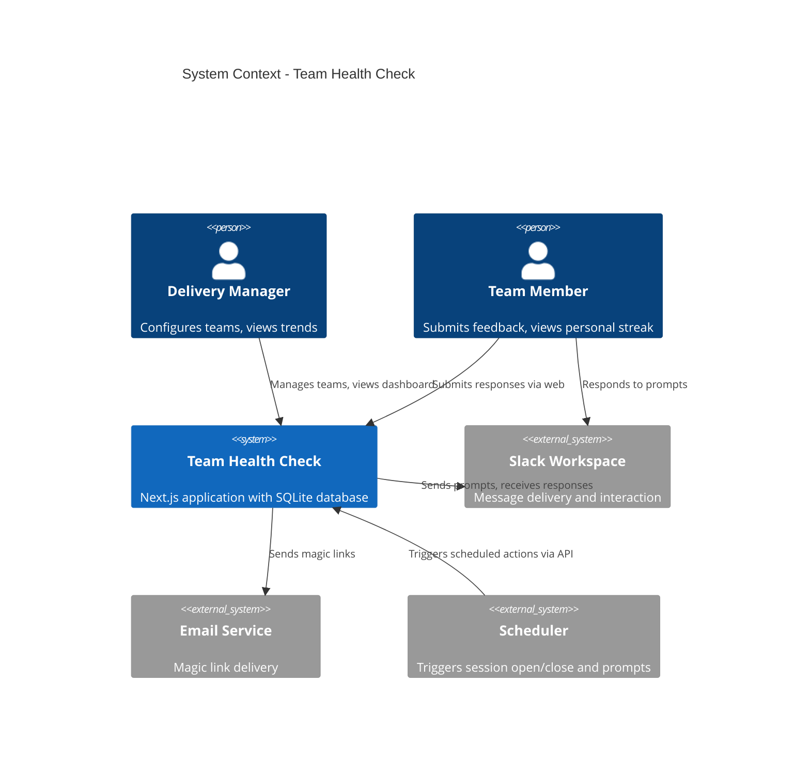
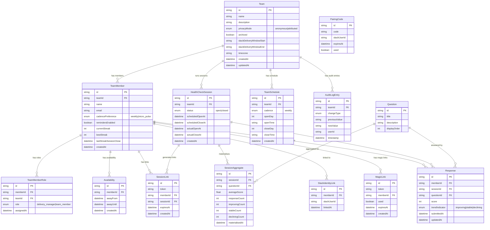
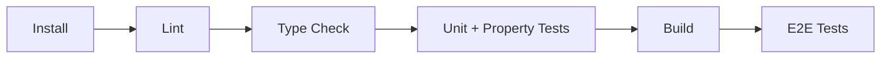

Any # Technical Design Document: Team Health Check

## Overview

Team Health Check is a lightweight feedback tool for delivery teams, inspired by the Spotify Squad Health Check Model. It collects regular health-check responses from team members via a mobile-friendly web interface and Slack bot, then visualises trends over time to help delivery managers identify improvements or concerns.

The system is built as a single-instance Next.js 15 application (App Router) backed by SQLite via Prisma 7 with the better-sqlite3 driver adapter. It exposes a RESTful API consumed by both the web frontend and a Slack bot integration.

### Key Design Decisions

| Decision | Rationale |
|----------|-----------|
| SQLite over PostgreSQL | Single-instance deployment, small team sizes (2-30), simplifies ops |
| Session links + Magic links over OAuth | Minimises friction — no login walls for feedback submission |
| Materialised aggregates at session close | Enables data deletion without affecting trend accuracy |
| Rolling average across sessions | Provides instant feedback even when current session has few responses |
| Append-only audit log | Immutable history for compliance and traceability |
| Weighted random question selection | Ensures micro-pulse users cover all questions within a session window |

## Architecture

### System Context Diagram



### High-Level Architecture

```mermaid
graph TB
    subgraph "Client Layer"
        WEB[Web Interface<br/>Next.js App Router]
        SLACK[Slack Bot<br/>Event Handler]
    end

    subgraph "API Layer (Next.js Route Handlers)"
        TEAMS[/api/teams/*]
        SESSIONS[/api/sessions/*]
        RESPONSES[/api/responses/*]
        TRENDS[/api/trends/*]
        AUTH[/api/auth/*]
        SLACK_API[/api/slack/*]
        SCHEDULER[/api/scheduler/*]
    end

    subgraph "Service Layer"
        TEAM_SVC[TeamService]
        SESSION_SVC[SessionService]
        RESPONSE_SVC[ResponseService]
        TREND_SVC[TrendService]
        AUTH_SVC[AuthService]
        NOTIFICATION_SVC[NotificationService]
        AUDIT_SVC[AuditService]
        STREAK_SVC[StreakService]
    end

    subgraph "Data Layer"
        PRISMA[Prisma Client]
        SQLITE[(SQLite Database)]
    end

    WEB --> TEAMS & SESSIONS & RESPONSES & TRENDS & AUTH
    SLACK --> SLACK_API
    TEAMS & SESSIONS & RESPONSES & TRENDS & AUTH & SLACK_API & SCHEDULER --> TEAM_SVC & SESSION_SVC & RESPONSE_SVC & TREND_SVC & AUTH_SVC & NOTIFICATION_SVC & AUDIT_SVC & STREAK_SVC
    TEAM_SVC & SESSION_SVC & RESPONSE_SVC & TREND_SVC & AUTH_SVC & NOTIFICATION_SVC & AUDIT_SVC & STREAK_SVC --> PRISMA
    PRISMA --> SQLITE
```

### Request Flow

1. **Web submission**: Team member clicks Session Link → Next.js page identifies member via token → renders questions → POST to `/api/responses` → upsert response → display rolling average
2. **Slack submission**: Slack sends interaction payload → `/api/slack/interactions` (uses "immediate ack + deferred processing" pattern) → validate + extract scores → POST internally to ResponseService → ack to Slack
3. **Scheduled actions**: Cron triggers `/api/scheduler/tick` → SessionService checks for sessions to open/close → NotificationService sends prompts/reminders

## Components and Interfaces

### API Route Structure

```
src/app/api/
├── teams/
│   ├── route.ts                    # GET (list), POST (create)
│   ├── genesis/
│   │   └── route.ts                # POST (create team + member + role from pending magic link token)
│   └── [teamId]/
│       ├── route.ts                # GET, PATCH, DELETE (archive)
│       ├── members/
│       │   ├── route.ts            # GET, POST (add member)
│       │   └── [memberId]/
│       │       └── route.ts        # PATCH, DELETE (remove)
│       ├── sessions/
│       │   ├── route.ts            # GET (list), POST (open manual)
│       │   └── [sessionId]/
│       │       ├── route.ts        # GET, PATCH (close)
│       │       └── participation/
│       │           └── route.ts    # GET
│       ├── schedule/
│       │   └── route.ts            # GET, PUT
│       ├── trends/
│       │   └── route.ts            # GET
│       ├── export/
│       │   └── route.ts            # GET (CSV download)
│       └── audit-log/
│           └── route.ts            # GET
├── responses/
│   └── route.ts                    # POST (submit/upsert)
├── auth/
│   ├── session-link/
│   │   └── [token]/
│   │       └── route.ts            # GET (validate + identify)
│   ├── magic-link/
│   │   ├── request/
│   │   │   └── route.ts            # POST (send magic link)
│   │   └── verify/
│   │       └── [token]/
│   │           └── route.ts        # GET (verify + create session OR return genesis state)
│   └── slack-pairing/
│       └── route.ts                # POST (submit pairing code)
├── slack/
│   ├── events/
│   │   └── route.ts                # POST (Slack events)
│   ├── interactions/
│   │   └── route.ts                # POST (button/menu callbacks)
│   └── commands/
│       └── route.ts                # POST (slash commands)
├── scheduler/
│   └── tick/
│       └── route.ts                # POST (cron-triggered)
└── me/
    ├── route.ts                    # GET (current user profile)
    ├── preferences/
    │   └── route.ts                # PATCH (cadence, reminders)
    ├── availability/
    │   └── route.ts                # POST, DELETE (away marking)
    ├── streak/
    │   └── route.ts                # GET
    ├── slack-link/
    │   └── route.ts                # DELETE (unlink)
    └── delete-data/
        └── route.ts                # POST (GDPR deletion)
```

### Service Layer Interfaces

```typescript
// src/lib/services/team.service.ts
interface TeamService {
  create(name: string, description?: string, creatorId: string): Promise<Team>;
  archive(teamId: string, userId: string): Promise<void>;
  unarchive(teamId: string, userId: string): Promise<void>;
  addMember(teamId: string, name: string, email?: string): Promise<TeamMember>;
  removeMember(teamId: string, memberId: string, userId: string): Promise<void>;
  getMembers(teamId: string): Promise<TeamMember[]>;
  assignRole(teamId: string, memberId: string, role: Role, actorId: string): Promise<void>;
  removeRole(teamId: string, memberId: string, role: Role, actorId: string): Promise<void>;
}

// src/lib/services/session.service.ts
interface SessionService {
  open(teamId: string, userId?: string): Promise<HealthCheckSession>;
  close(sessionId: string, userId?: string): Promise<void>;
  getActive(teamId: string): Promise<HealthCheckSession | null>;
  materializeAggregates(sessionId: string): Promise<void>;
  generateSessionLinks(sessionId: string): Promise<void>;
}

// src/lib/services/response.service.ts
interface ResponseService {
  upsert(params: {
    memberId: string;
    sessionId: string;
    questionId: string;
    score: number;
    trendIndicator?: TrendIndicator;
  }): Promise<Response>;
  getByMemberAndSession(memberId: string, sessionId: string): Promise<Response[]>;
  getRollingAverage(teamId: string, questionId: string, count?: number): Promise<number | null>;
}

// src/lib/services/auth.service.ts
interface AuthService {
  validateSessionLink(token: string): Promise<{ memberId: string; sessionId: string } | null>;
  requestMagicLink(email: string): Promise<void>;
  verifyMagicLink(token: string): Promise<MagicLinkVerifyResult>;
  generatePairingCode(slackUserId: string): Promise<string>;
  verifyPairingCode(memberId: string, code: string): Promise<boolean>;
}

// Discriminated union for magic link verification outcomes
type MagicLinkVerifyResult =
  | { status: 'authenticated'; memberId: string; sessionToken: string }
  | { status: 'requires_team_creation'; pendingToken: string; email: string };

// src/lib/services/trend.service.ts
interface TrendService {
  getSessionAverages(teamId: string, questionId?: string): Promise<SessionAverage[]>;
  getTrendIndicatorDistribution(sessionId: string): Promise<TrendDistribution[]>;
  exportCSV(teamId: string, dateRange?: { from: Date; to: Date }): Promise<string>;
}

// src/lib/services/notification.service.ts
interface NotificationService {
  sendSlackPrompt(memberId: string, session: HealthCheckSession): Promise<void>;
  sendClosingReminder(memberId: string, session: HealthCheckSession): Promise<void>;
  sendMidSessionNudge(memberId: string, session: HealthCheckSession): Promise<void>;
  sendPreSessionNotification(teamId: string, session: HealthCheckSession): Promise<void>;
}

// src/lib/services/streak.service.ts
interface StreakService {
  calculate(memberId: string): Promise<{ current: number; best: number }>;
  isProtected(memberId: string): Promise<boolean>;
}

// src/lib/services/audit.service.ts
interface AuditService {
  log(entry: {
    teamId: string;
    changeType: AuditChangeType;
    previousValue: string;
    newValue: string;
    userId: string;
  }): Promise<void>;
  getLog(teamId: string, pagination?: { cursor?: string; limit?: number }): Promise<AuditEntry[]>;
}
```

### Validation Layer

```typescript
// src/lib/validation/schemas.ts
// Using Zod for runtime validation (to be added as dependency)

const createTeamSchema = z.object({
  name: z.string().trim().min(1).max(100),
  description: z.string().max(500).optional(),
});

const addMemberSchema = z.object({
  name: z.string().trim().min(1).max(100),
  email: z.string().email().optional(),
});

const submitResponseSchema = z.object({
  responses: z.array(z.object({
    questionId: z.string(),
    score: z.number().int().min(1).max(5),
    trendIndicator: z.enum(['improving', 'stable', 'declining']).optional(),
  })).min(1),
});

const scheduleSchema = z.object({
  cadence: z.enum(['weekly']),
  openDay: z.number().int().min(0).max(6),
  openTime: z.string().regex(/^\d{2}:\d{2}$/),
  closeDay: z.number().int().min(0).max(6),
  closeTime: z.string().regex(/^\d{2}:\d{2}$/),
  timezone: z.string().default('Europe/London'),
});
```

## Data Models

### Entity Relationship Diagram



### Prisma Schema

```prisma
generator client {
  provider = "prisma-client-js"
  output   = "../src/generated/prisma"
}

datasource db {
  provider = "sqlite"
  url      = "file:./dev.db"
}

model Team {
  id                     String              @id @default(cuid())
  name                   String
  description            String?
  privacyMode            String              @default("anonymous") // "anonymous" | "attributed"
  archived               Boolean             @default(false)
  slackDeliveryStart     String?             // HH:mm format
  slackDeliveryEnd       String?             // HH:mm format
  timezone               String              @default("Europe/London")
  createdAt              DateTime            @default(now())
  updatedAt              DateTime            @updatedAt

  members                TeamMember[]
  sessions               HealthCheckSession[]
  schedule               TeamSchedule?
  auditLog               AuditLogEntry[]
}

model TeamMember {
  id                     String              @id @default(cuid())
  teamId                 String
  name                   String
  email                  String?
  cadencePreference      String              @default("weekly") // "weekly" | "micro_pulse"
  remindersEnabled       Boolean             @default(true)
  currentStreak          Int                 @default(0)
  bestStreak             Int                 @default(0)
  lastStreakSessionClose DateTime?
  createdAt              DateTime            @default(now())

  team                   Team                @relation(fields: [teamId], references: [id])
  roles                  TeamMemberRole[]
  responses              Response[]
  sessionLinks           SessionLink[]
  magicLinks             MagicLink[]
  slackLink              SlackIdentityLink?
  availability           Availability[]

  @@unique([teamId, name, email])
}

model TeamMemberRole {
  id                     String              @id @default(cuid())
  memberId               String
  teamId                 String
  role                   String              // "delivery_manager" | "team_member"
  assignedAt             DateTime            @default(now())

  member                 TeamMember          @relation(fields: [memberId], references: [id])

  @@unique([memberId, teamId, role])
}

model HealthCheckSession {
  id                     String              @id @default(cuid())
  teamId                 String
  status                 String              @default("open") // "open" | "closed"
  scheduledOpenAt        DateTime?
  scheduledCloseAt       DateTime?
  actualOpenAt           DateTime            @default(now())
  actualCloseAt          DateTime?
  createdAt              DateTime            @default(now())

  team                   Team                @relation(fields: [teamId], references: [id])
  responses              Response[]
  sessionLinks           SessionLink[]
  aggregates             SessionAggregate[]
}

model Question {
  id                     String              @id @default(cuid())
  title                  String
  description            String
  displayOrder           Int

  responses              Response[]
  aggregates             SessionAggregate[]
}

model Response {
  id                     String              @id @default(cuid())
  memberId               String
  sessionId              String
  questionId             String
  score                  Int
  trendIndicator         String?             // "improving" | "stable" | "declining"
  submittedAt            DateTime            @default(now())
  updatedAt              DateTime            @updatedAt

  member                 TeamMember          @relation(fields: [memberId], references: [id])
  session                HealthCheckSession  @relation(fields: [sessionId], references: [id])
  question               Question            @relation(fields: [questionId], references: [id])

  @@unique([memberId, sessionId, questionId])
}

model SessionLink {
  id                     String              @id @default(cuid())
  token                  String              @unique
  memberId               String
  sessionId              String
  expiresAt              DateTime
  createdAt              DateTime            @default(now())

  member                 TeamMember          @relation(fields: [memberId], references: [id])
  session                HealthCheckSession  @relation(fields: [sessionId], references: [id])
}

model MagicLink {
  id                     String              @id @default(cuid())
  token                  String              @unique
  memberId               String
  used                   Boolean             @default(false)
  expiresAt              DateTime
  createdAt              DateTime            @default(now())

  member                 TeamMember          @relation(fields: [memberId], references: [id])
}

model SlackIdentityLink {
  id                     String              @id @default(cuid())
  memberId               String              @unique
  slackUserId            String              @unique
  linkedAt               DateTime            @default(now())

  member                 TeamMember          @relation(fields: [memberId], references: [id])
}

model PairingCode {
  id                     String              @id @default(cuid())
  code                   String              @unique
  slackUserId            String
  used                   Boolean             @default(false)
  expiresAt              DateTime
  createdAt              DateTime            @default(now())
}

model TeamSchedule {
  id                     String              @id @default(cuid())
  teamId                 String              @unique
  cadence                String              @default("weekly")
  openDay                Int                 // 0=Sunday, 1=Monday, ...
  openTime               String              // HH:mm
  closeDay               Int
  closeTime              String              // HH:mm
  createdAt              DateTime            @default(now())

  team                   Team                @relation(fields: [teamId], references: [id])
}

model SessionAggregate {
  id                     String              @id @default(cuid())
  sessionId              String
  questionId             String
  averageScore           Float
  responseCount          Int
  improvingCount         Int                 @default(0)
  stableCount            Int                 @default(0)
  decliningCount         Int                 @default(0)
  materialisedAt         DateTime            @default(now())

  session                HealthCheckSession  @relation(fields: [sessionId], references: [id])
  question               Question            @relation(fields: [questionId], references: [id])

  @@unique([sessionId, questionId])
}

model Availability {
  id                     String              @id @default(cuid())
  memberId               String
  awayFrom               DateTime
  awayUntil              DateTime
  createdAt              DateTime            @default(now())

  member                 TeamMember          @relation(fields: [memberId], references: [id])
}

model AuditLogEntry {
  id                     String              @id @default(cuid())
  teamId                 String
  changeType             String
  previousValue          String
  newValue               String
  userId                 String
  timestamp              DateTime            @default(now())

  team                   Team                @relation(fields: [teamId], references: [id])
}

model UserSession {
  id                     String              @id @default(cuid())
  memberId               String
  token                  String              @unique
  expiresAt              DateTime
  createdAt              DateTime            @default(now())
}

model PendingGenesis {
  id                     String              @id @default(cuid())
  token                  String              @unique
  email                  String
  used                   Boolean             @default(false)
  expiresAt              DateTime
  createdAt              DateTime            @default(now())
}
```

### Seed Data (Fixed Questions)

```typescript
// prisma/seed.ts
const QUESTIONS = [
  { id: 'q-delivering-value', title: 'Delivering Value', description: 'How well is the team delivering value to users and stakeholders?', displayOrder: 1 },
  { id: 'q-team-collaboration', title: 'Team Collaboration', description: 'How effectively does the team work together and support each other?', displayOrder: 2 },
  { id: 'q-ease-of-delivery', title: 'Ease of Delivery', description: 'How easy is it to get work done without unnecessary blockers or friction?', displayOrder: 3 },
  { id: 'q-learning-improving', title: 'Learning and Improving', description: 'How well does the team learn from experience and continuously improve?', displayOrder: 4 },
  { id: 'q-psychological-safety', title: 'Psychological Safety', description: 'How safe do team members feel to speak up, take risks, and be vulnerable?', displayOrder: 5 },
];
```

## Correctness Properties

*A property is a characteristic or behavior that should hold true across all valid executions of a system — essentially, a formal statement about what the system should do. Properties serve as the bridge between human-readable specifications and machine-verifiable correctness guarantees.*

### Property 1: Valid entity creation preserves data

*For any* valid team name (1-100 non-whitespace-only characters) and valid member name (1-100 characters) with optional valid email, creating the entity and then reading it back SHALL return the same name and description/email that was submitted.

**Validates: Requirements 1.1, 1.3**

### Property 2: Whitespace-only team names are rejected

*For any* string composed entirely of whitespace characters (spaces, tabs, newlines) of any length, attempting to create a team with that string as the name SHALL be rejected with a validation error, and no team SHALL be created.

**Validates: Requirements 1.2**

### Property 3: Invalid emails are rejected, valid emails are accepted

*For any* string that does not conform to a valid email format (missing @, missing domain, etc.), adding a team member with that email SHALL be rejected. Conversely, *for any* string conforming to valid email format, the request SHALL be accepted.

**Validates: Requirements 1.4**

### Property 4: Team member uniqueness invariant

*For any* team and any (name, email) combination, adding that member a second time to the same team SHALL be rejected, while the first addition SHALL succeed. The team SHALL contain exactly one record for that combination.

**Validates: Requirements 1.5**

### Property 5: Member removal preserves historical responses

*For any* team member who has submitted responses across any number of sessions, removing them from the team SHALL preserve all their historical response records in the database while disassociating them from the active team roster.

**Validates: Requirements 1.6**

### Property 6: Archive/unarchive round-trip restores functionality

*For any* active team with any configuration (schedule, members, open session), archiving and then unarchiving SHALL restore the team to a state where new sessions can be opened, schedules resume, and all historical data remains accessible.

**Validates: Requirements 1.9, 1.10**

### Property 7: Pairing codes expire within 10 minutes

*For any* generated pairing code, verifying it at a time strictly greater than 10 minutes after generation SHALL fail, while verifying it within the 10-minute window with the correct code SHALL succeed.

**Validates: Requirements 2.3, 2.5**

### Property 8: Only linked members receive Slack prompts

*For any* team with a mix of Slack-linked and unlinked members, when prompts are generated for an open session, the set of prompt recipients SHALL be exactly the subset of members with valid Slack identity links.

**Validates: Requirements 2.8, 5.13**

### Property 9: Submissions succeed if and only if the member belongs to the team

*For any* open health check session and any user, a response submission SHALL succeed if and only if that user is a current member of the session's team. Non-members SHALL always receive a rejection.

**Validates: Requirements 3.6, 3.7**

### Property 10: Closed sessions reject all submissions

*For any* closed health check session and any valid team member with any valid score, attempting to submit a response SHALL be rejected with a message indicating the session has ended.

**Validates: Requirements 3.8, 4.9, 6.5**

### Property 11: Score validation — accept [1,5], reject outside

*For any* integer score value, a response submission SHALL be accepted if and only if the score is between 1 and 5 inclusive. Scores outside this range SHALL be rejected with a validation error for the affected question.

**Validates: Requirements 4.4, 4.5, 5.6, 5.7**

### Property 12: Response upsert — exactly one record per (member, question, session)

*For any* team member, question, and session, regardless of how many times a response is submitted, there SHALL be exactly one response record in the database for that combination, and its score and trend indicator SHALL reflect the most recently submitted values.

**Validates: Requirements 10.2, 10.3, 4.8**

### Property 13: Session link generation and round-trip validation

*For any* team with N members when a session is opened, exactly N session links SHALL be generated, each containing a token of at least 32 cryptographically random characters. Accessing any generated token SHALL correctly identify the associated team member and session.

**Validates: Requirements 6.1, 6.2, 6.3**

### Property 14: Invalid session link tokens return 404

*For any* random string that was not generated as a session link token, accessing it SHALL return an HTTP 404 response with a generic error message that does not reveal proximity to valid tokens.

**Validates: Requirements 6.4**

### Property 15: Magic link single-use and time-bounded

*For any* generated magic link, it SHALL be usable exactly once within 1 hour of creation. A second access of the same token SHALL fail, and any access after 1 hour SHALL fail regardless of prior use.

**Validates: Requirements 7.2, 7.4**

### Property 16: Session average computation correctness

*For any* set of responses within a closed session for a given question, the materialised average score SHALL equal the arithmetic mean of those scores rounded to one decimal place, and the response count SHALL equal the number of responses submitted.

**Validates: Requirements 8.1**

### Property 17: Data suppression for insufficient responses in anonymous mode

*For any* question within a closed session belonging to a team in anonymous privacy mode, if the response count is fewer than the configured threshold (default 3), the trend dashboard SHALL suppress the average and display "insufficient data" instead. If a question has zero responses, that data point SHALL be omitted entirely.

**Validates: Requirements 8.6, 8.7**

### Property 18: CSV export serialization round-trip

*For any* set of trend data (session averages, response counts, trend indicator distributions), exporting to CSV and parsing the resulting CSV SHALL produce values matching the original data. The CSV SHALL contain columns for session date, question, average score, response count, and trend indicator distribution.

**Validates: Requirements 8.9**

### Property 19: Anonymous mode CSV contains no individual data

*For any* team in anonymous privacy mode, the CSV export SHALL never contain individual team member identifiers, individual scores, or any data from which individual responses could be reconstructed.

**Validates: Requirements 8.10, 14.2**

### Property 20: Question order invariant

*For any* session and any team member, the questions SHALL always be returned in the fixed order: Delivering Value, Team Collaboration, Ease of Delivery, Learning and Improving, Psychological Safety.

**Validates: Requirements 9.1, 9.3**

### Property 21: Rolling average computation correctness

*For any* question and team, the rolling average SHALL equal the arithmetic mean of the most recent N scores (default 20) across current and previous sessions. The average SHALL only be displayed when at least 5 responses exist for that question.

**Validates: Requirements 16.1, 16.2, 16.3**

### Property 22: Streak calculation correctness

*For any* sequence of health check sessions and a team member's participation pattern, the streak count SHALL equal the number of consecutive sessions (most recent first) in which the member submitted at least one response, with the following modifiers: (a) sessions during which the member was marked as away are excluded from consideration, (b) one missed session within a rolling 14-day window does not break the streak.

**Validates: Requirements 17.1, 17.3, 17.7**

### Property 23: Cadence change preserves streak

*For any* team member with a non-zero streak, changing their cadence preference from weekly to micro-pulse or vice versa SHALL not modify their current streak count or best streak count.

**Validates: Requirements 17.6**

### Property 24: Audit log completeness and immutability

*For any* team configuration change (privacy mode, schedule, member add/remove, delivery window, notification recipient), an audit entry SHALL be created containing the change type, previous value, new value, acting user identity, and UTC timestamp. No audit entry SHALL be modifiable or deletable through any interface. No audit entry SHALL contain individual response scores.

**Validates: Requirements 18.1, 18.2, 18.3, 18.6**

### Property 25: Role-based access control enforcement

*For any* user holding only the team_member role, attempting any delivery_manager-only action (team edit, member management, schedule config, privacy mode change, session management, participation names in anonymous mode, audit log access) SHALL be rejected. *For any* delivery_manager, these actions SHALL be permitted.

**Validates: Requirements 19.2, 19.3, 19.8, 19.9**

### Property 26: Minimum one delivery manager constraint

*For any* team with delivery manager role assignments, removing a delivery_manager role SHALL succeed only if at least one other delivery_manager would remain. If removal would result in zero delivery managers, it SHALL be rejected.

**Validates: Requirements 19.6, 19.7**

### Property 27: API error response format consistency

*For any* API request with invalid or missing required fields, the response SHALL be HTTP 400 with a JSON body containing a top-level "errors" array. *For any* request referencing a non-existent resource, the response SHALL be HTTP 404 with a JSON error message. All API responses SHALL have Content-Type: application/json.

**Validates: Requirements 20.2, 20.3, 20.4**

### Property 28: Data deletion preserves materialised aggregates

*For any* team member who requests data deletion, all their individual response records SHALL be removed from the database, but all previously materialised session aggregates SHALL remain unchanged in value.

**Validates: Requirements 4.5, 4.6**

### Property 29: Privacy mode prevents individual data exposure

*For any* team in anonymous privacy mode, no API response, dashboard view, or export SHALL expose individual team member scores, trend indicators, or identifiers linked to specific responses. Only aggregated data (averages, distributions, counts) SHALL be accessible.

**Validates: Requirements 14.2, 14.3, 20.6**

### Property 30: Availability exclusion from participation

*For any* team member marked as away during a health check session's duration, they SHALL be excluded from participation counts, SHALL NOT receive any prompts or reminders, and their absence SHALL NOT be treated as non-response for any metric.

**Validates: Requirements 12.1, 12.2**

### Property 31: At-most-one open session per team (Highlander invariant)

*For any* Team at any point in time, the database SHALL contain at most one HealthCheckSession with a status of `'open'` for that team. Any operation that would result in a new open session (scheduled open, manual open, or concurrent duplicate request) MUST atomically close any existing open session for that team before creating the new one. After any sequence of open/close operations, a count query of open sessions per team SHALL never return a value greater than 1.

**Validates: Requirements 3.8, 3.9**

### Property 32: Micro-pulse question exhaustion guarantee

*For any* micro-pulse TeamMember who remains active (not marked as away) through the entire duration of a HealthCheckSession, the union of all Questions delivered to them via Slack prompts within that session window SHALL exactly equal the full set of 5 fixed Questions. No question SHALL be delivered more than once, and no question SHALL be omitted. When remaining active days in the session are fewer than unanswered questions, a single prompt SHALL contain multiple questions to guarantee coverage.

**Validates: Requirements 15.5, 15.6**

### Property 33: Live participation decrement on mid-session data deletion

*For any* active HealthCheckSession with a live participation count of C (where C equals the number of distinct members who have submitted at least one response), if a participating TeamMember executes the GDPR data deletion flow during that session, the live participation count SHALL immediately evaluate to C - 1, the deleted member's responses SHALL no longer appear in the session's data, and their name SHALL appear in the non-responder list (or be excluded entirely in anonymous mode).

**Validates: Requirements 4.5, 4.6**

### Property 34: Magic link response indistinguishability (anti-enumeration)

*For any* email address submitted to the magic link request endpoint — whether associated with an existing TeamMember, an unknown address, or a malformed string that passes format validation — the HTTP response status code, response body structure, and observable processing time SHALL be indistinguishable from the perspective of an unauthenticated client. Specifically: the response SHALL always be HTTP 200 with an identical JSON body (e.g., `{ "data": { "message": "If this email is registered, a link has been sent." } }`), and processing time variance between known and unknown emails SHALL be less than 50ms (achieved via constant-time code paths or artificial delay normalisation).

**Validates: Requirements 7.5, 7.8, 7.9**

## Error Handling

### Error Response Structure

All API errors follow a consistent JSON structure:

```typescript
// Success responses
interface ApiSuccess<T> {
  data: T;
}

// Error responses
interface ApiError {
  errors: Array<{
    field?: string;      // field name for validation errors
    message: string;     // human-readable error description
    code: string;        // machine-readable error code
  }>;
}
```

### Error Categories and HTTP Status Codes

| Status | Category | Example |
|--------|----------|---------|
| 400 | Validation Error | Missing required field, score out of range, invalid email |
| 401 | Unauthenticated | No valid session, expired magic link |
| 403 | Forbidden | team_member attempting delivery_manager action |
| 404 | Not Found | Invalid session link token, non-existent team/member |
| 409 | Conflict | Duplicate team member, session already closed |
| 429 | Rate Limited | Too many failed session link attempts, magic link spam |
| 500 | Internal Error | Unexpected failures (generic message, no details exposed) |

### Rate Limiting Strategy

| Endpoint | Limit | Window | Lockout |
|----------|-------|--------|---------|
| Session link access (failed) | 10 attempts | 5 minutes | 15 minutes per IP |
| Magic link requests | 5 per email | 1 hour | Soft reject with message |
| Slack pairing code generation | 3 per user | 1 hour | Inform user to wait |
| API general | 100 requests | 1 minute | 429 response |

Rate limiting is implemented **in-memory** using a sliding window counter Map. This avoids the TOCTOU race condition inherent in database-based count-then-create approaches (concurrent requests can all read count=0 and bypass the limit). Since this is a single-instance deployment, in-memory state is naturally atomic within the Node.js event loop and avoids SQLite write contention.

**Tradeoff**: Rate limit state resets on server restart. For a small-team internal tool, this is acceptable — an attacker would need to know the exact restart window to exploit it.

```typescript
// src/lib/rate-limit.ts

interface RateLimitEntry {
  count: number;
  windowStart: number;
}

// In-memory sliding window store — keyed by "category:identifier"
const store = new Map<string, RateLimitEntry>();

// Periodic cleanup to prevent unbounded memory growth
const CLEANUP_INTERVAL_MS = 60_000;
const MAX_WINDOW_MS = 3_600_000; // 1 hour (longest window used)

setInterval(() => {
  const now = Date.now();
  for (const [key, entry] of store) {
    if (now - entry.windowStart > MAX_WINDOW_MS) {
      store.delete(key);
    }
  }
}, CLEANUP_INTERVAL_MS);

export function checkRateLimit(key: string, limit: number, windowMs: number): boolean {
  const now = Date.now();
  const entry = store.get(key);

  if (!entry || now - entry.windowStart > windowMs) {
    // Window expired or first request — start a new window
    store.set(key, { count: 1, windowStart: now });
    return true; // Allowed
  }

  if (entry.count >= limit) {
    return false; // Rate limited
  }

  entry.count += 1;
  return true; // Allowed
}
```

**Note**: The `RateLimitRecord` model is removed from the Prisma schema. Rate limiting is purely in-memory. If the deployment model changes to multi-instance in the future, this should be revisited with Redis or an atomic DB upsert approach.

### Error Handling Patterns

1. **Validation errors**: Caught at the route handler level using Zod schemas. Each failed field produces an entry in the errors array.
2. **Business logic errors**: Services throw typed errors (e.g., `SessionClosedError`, `DuplicateMemberError`) which route handlers map to appropriate HTTP codes.
3. **Database errors**: Prisma constraint violations caught and translated to 409 Conflict or 400 Bad Request.
4. **Unexpected errors**: Caught by a global error boundary in each route handler that logs the full error internally but returns only a generic 500 to the client.

```typescript
// src/lib/api-utils.ts
export function withErrorHandling(handler: RouteHandler): RouteHandler {
  return async (req, ctx) => {
    try {
      return await handler(req, ctx);
    } catch (error) {
      if (error instanceof ValidationError) {
        return Response.json({ errors: error.fields }, { status: 400 });
      }
      if (error instanceof NotFoundError) {
        return Response.json({ errors: [{ message: 'Resource not found', code: 'NOT_FOUND' }] }, { status: 404 });
      }
      if (error instanceof ForbiddenError) {
        return Response.json({ errors: [{ message: error.message, code: 'FORBIDDEN' }] }, { status: 403 });
      }
      if (error instanceof ConflictError) {
        return Response.json({ errors: [{ message: error.message, code: 'CONFLICT' }] }, { status: 409 });
      }
      console.error('Unexpected error:', error);
      return Response.json(
        { errors: [{ message: 'An unexpected error occurred', code: 'INTERNAL_ERROR' }] },
        { status: 500 }
      );
    }
  };
}
```

### Aggregate Materialisation and Quiet Period

When a session closes, the system does NOT materialise aggregates inline. Instead, it uses lazy materialisation via the scheduler:

1. Session status set to `closed`, `actualCloseAt` recorded
2. `materialisedAt` field on `HealthCheckSession` remains null (pending)
3. On the next scheduler tick after `actualCloseAt + QUIET_PERIOD_MS` has elapsed, the scheduler detects unmaterialised closed sessions and triggers materialisation

This approach survives serverless function timeouts, process restarts, and deployments.

## Testing Strategy

### Testing Approach

The testing strategy uses a **dual approach** combining property-based tests (for universal invariants) and example-based unit tests (for specific scenarios and edge cases).

### Property-Based Testing

**Library**: [fast-check](https://github.com/dubzzz/fast-check) (TypeScript PBT library, well-maintained, excellent Vitest integration)

**Configuration**:
- Minimum 100 iterations per property test
- Each property test tagged with its design document property reference
- Tag format: `Feature: team-health-check, Property {number}: {property_text}`

**Property tests cover**:
- Input validation (team names, emails, scores) — Properties 2, 3, 11
- Data integrity invariants (uniqueness, upserts, response storage) — Properties 4, 5, 12
- Authentication token lifecycle (session links, magic links, pairing codes) — Properties 7, 13, 14, 15
- Computation correctness (averages, streaks, rolling averages) — Properties 16, 21, 22
- Privacy enforcement (anonymous mode data suppression) — Properties 17, 19, 29
- Access control (role-based permissions) — Properties 25, 26
- Serialization (CSV export) — Properties 18, 19
- Audit immutability — Property 24
- Data deletion preservation — Property 28
- Session uniqueness invariant — Property 31
- Micro-pulse question coverage — Property 32
- Live participation on deletion — Property 33
- Anti-enumeration timing safety — Property 34

### Example-Based Unit Tests

**Focus areas**:
- Session lifecycle state machine (open → close → reject)
- Scheduler integration (auto-open, auto-close)
- Slack message formatting and delivery
- UI component rendering (question forms, dashboard)
- Magic link request flow
- Team archive/unarchive side effects
- Pre-session notifications
- Mid-session nudge targeting

### Integration Tests

**Focus areas**:
- Slack API interaction (mocked with msw)
- Email delivery (mocked)
- Scheduler tick processing end-to-end
- Full response submission flow (session link → form → upsert → rolling average)
- CSV export generation

### Accessibility Tests

- jest-axe scans on all page components (existing pattern in project)
- Keyboard navigation tests for feedback form
- ARIA label verification for chart components
- Colour contrast verification (automated where possible, manual for charts)

### Test Organisation

```
src/tests/
├── setup.ts                    # msw server lifecycle
├── mocks/
│   ├── handlers.ts             # API mock handlers
│   └── server.ts               # msw setupServer
├── properties/                 # Property-based tests
│   ├── validation.property.ts  # Properties 2, 3, 11
│   ├── data-integrity.property.ts # Properties 4, 5, 12
│   ├── auth-tokens.property.ts # Properties 7, 13, 14, 15
│   ├── computation.property.ts # Properties 16, 21, 22
│   ├── privacy.property.ts     # Properties 17, 19, 29
│   ├── access-control.property.ts # Properties 25, 26
│   ├── serialization.property.ts # Properties 18, 19
│   ├── audit.property.ts       # Property 24
│   ├── deletion.property.ts    # Properties 28, 33
│   ├── session-invariants.property.ts # Property 31
│   ├── micro-pulse.property.ts # Property 32
│   └── anti-enumeration.property.ts # Property 34
├── unit/
│   ├── services/
│   │   ├── team.service.test.ts
│   │   ├── session.service.test.ts
│   │   ├── response.service.test.ts
│   │   ├── trend.service.test.ts
│   │   ├── auth.service.test.ts
│   │   ├── notification.service.test.ts
│   │   ├── streak.service.test.ts
│   │   └── audit.service.test.ts
│   └── validation/
│       └── schemas.test.ts
├── integration/
│   ├── session-lifecycle.test.ts
│   ├── response-submission.test.ts
│   ├── slack-interaction.test.ts
│   └── scheduler.test.ts
└── ui/
    ├── feedback-form.test.tsx
    ├── trend-dashboard.test.tsx
    ├── team-management.test.tsx
    └── accessibility.test.tsx
```

### Dependencies to Add

```json
{
  "devDependencies": {
    "fast-check": "^3.x",
    "zod": "^3.x"
  },
  "dependencies": {
    "zod": "^3.x"
  }
}
```

Note: `zod` is listed in both because it's used at runtime for API validation, while `fast-check` is test-only.

### Security Testing

| Area | Test Approach |
|------|---------------|
| Session link token enumeration | Verify that token validation uses timing-safe comparison (`crypto.timingSafeEqual`). Measure response time variance across valid/invalid tokens — delta should be <1ms. |
| Magic link replay prevention | Submit a valid magic link token, then attempt reuse — second attempt SHALL return 401. Verify the `used` flag is set atomically within the same transaction as session creation. |
| Rate limiting under load | Simulate burst requests (10+ within window) to rate-limited endpoints and verify 429 responses begin at the configured threshold. Verify lockout duration is enforced. |
| Input sanitization (XSS) | Submit team names, descriptions, and member names containing `<script>`, event handlers (`onerror=`), and encoded payloads. Verify stored values are sanitized or output-escaped. No raw HTML execution in rendered pages. |
| CSRF protection on Slack webhooks | Verify that Slack interaction endpoints reject requests missing the `X-Slack-Signature` header or with invalid signatures. Non-Slack origins SHALL receive 401. |
| Slack request signature verification | Validate that the `/api/slack/*` handlers compute HMAC-SHA256 over the `X-Slack-Request-Timestamp` + request body and compare against `X-Slack-Signature` using timing-safe comparison. Requests older than 5 minutes SHALL be rejected (replay window). |
| Error message information leakage | Verify 404 responses for invalid session link tokens contain no proximity hints (e.g., "token not found" not "token expired 2 minutes ago"). Verify 500 responses never expose stack traces, file paths, or database details. |
| Privacy mode enforcement | In anonymous mode, verify all API responses (trends, participation, CSV export) contain zero individual identifiers. Fuzz test the API with role escalation attempts to ensure no endpoint leaks individual data. |

### E2E Testing

**Tool**: [Playwright](https://playwright.dev/) — standard for Next.js end-to-end testing, cross-browser support, built-in network interception.

**Scope**: Full user flows through the browser simulating real interactions.

**Key flows to cover**:

1. **Authentication flow**: Magic link request → email intercepted (mocked SMTP or mailbox API) → click link → verified session → redirect to dashboard
2. **Feedback submission flow**: Session link → feedback form renders all 5 questions → submit scores + trend indicators → confirmation page → rolling average displayed
3. **Dashboard trends**: Navigate to team dashboard → verify trend chart renders with real session data → verify data point tooltips match aggregated values
4. **Team management flow**: Create team → add members (with/without email) → configure weekly schedule → verify schedule persists on page reload
5. **Cadence preference change**: Member updates preference from weekly to micro-pulse → verify prompt behaviour change reflects on next session (via mocked scheduler)

**Not covered by E2E** (use integration tests instead):
- Slack bot interactions (not browser-based, tested via HTTP mocking against `/api/slack/*`)

**Test organisation**:

```
src/tests/e2e/
├── auth.spec.ts                 # Magic link flows
├── feedback-submission.spec.ts  # Session link → submit → confirmation
├── dashboard-trends.spec.ts     # Chart rendering, data accuracy
├── team-management.spec.ts      # CRUD flows for teams and members
└── cadence-preferences.spec.ts  # Member preference changes
```

**CI integration**: Runs as a separate pipeline step after unit/integration tests pass. Uses the built Next.js app (`npm run build` then `npx playwright test` against the production build served locally).

## Code Quality Standards

### File and Function Length

- **File length**: Prefer under 200 lines per file. Extract into separate modules when exceeding 300 lines.
- **Function length**: Prefer under 30 lines. Extract helper functions for clarity when logic grows complex.

### Naming Conventions

| Entity | Convention | Example |
|--------|-----------|---------|
| Functions / variables | camelCase | `getRollingAverage`, `sessionId` |
| Types / interfaces / components | PascalCase | `TeamMember`, `TrendDashboard` |
| Files | kebab-case | `team.service.ts`, `auth-tokens.property.ts` |
| Constants | UPPER_SNAKE_CASE | `QUIET_PERIOD_MS`, `MAX_STREAK_GRACE_DAYS` |

### Architecture Conventions

- **Service layer**: Each service in its own file under `src/lib/services/`. Pure business logic separated from HTTP concerns. Services accept typed inputs and return typed outputs — no access to `Request`/`Response` objects.
- **Route handlers**: Thin controllers that validate input (Zod), call the appropriate service, and format the response. No business logic in route files.
- **Validation schemas**: Co-located in `src/lib/validation/schemas.ts` or per-domain files. Zod schemas are the single source of truth for input shapes.

### TypeScript Strictness

- `strict: true` in `tsconfig.json` (already configured)
- No `any` types — use `unknown` with type guards where input type is uncertain
- Explicit return types on all exported functions
- Prefer `interface` for object shapes, `type` for unions and intersections

### Import Organisation

```typescript
// 1. External dependencies
import { z } from 'zod';
import { PrismaClient } from '@prisma/client';

// 2. Internal modules (absolute paths via tsconfig paths)
import { prisma } from '@/lib/prisma';
import { checkRateLimit } from '@/lib/rate-limit';

// 3. Relative imports (same feature/module)
import { validateSessionLink } from './helpers';
```

Blank line between each group. No circular imports between service modules.

### Documentation and Comments

- Prefer self-documenting code (clear names, small functions, typed interfaces)
- Use JSDoc for exported public APIs only — describe what, not how
- Inline comments only for non-obvious business logic decisions (e.g., "quiet period ensures in-flight submissions complete")

### Error Handling

- Use typed error classes (`ValidationError`, `NotFoundError`, `ForbiddenError`, etc.) — never throw raw strings
- All thrown errors extend a base `AppError` class with `code` and `statusCode` fields
- Route handlers use `withErrorHandling` wrapper to translate errors to HTTP responses

### Linting

- ESLint config: `eslint-config-next` as base + additional rules:
  - `no-unused-vars` → error
  - `prefer-const` → error
  - `@typescript-eslint/no-explicit-any` → error
  - `@typescript-eslint/explicit-function-return-type` → warn (exported functions only)
- Lint runs in CI — errors fail the build

## CI/CD Pipeline

### Tool

GitHub Actions — existing `.github/workflows/ci.yml` to be expanded with the full pipeline below.

### Pipeline Stages



| Stage | Command | Failure behaviour |
|-------|---------|-------------------|
| **Install** | `npm ci` | Fail — dependencies broken |
| **Lint** | `npm run lint` | Fail — code quality violation |
| **Type check** | `npx tsc --noEmit` | Fail — type errors |
| **Unit + Property tests** | `npm test` | Fail — logic regression |
| **Build** | `npm run build` | Fail — runtime import or config issue |
| **E2E tests** | `npx playwright test` | Fail — user flow broken |

### Pipeline Definition

```yaml
name: CI

on:
  push:
    branches: [master]
  pull_request:
    branches: [master]

jobs:
  ci:
    name: Lint, Test, Build
    runs-on: ubuntu-latest

    steps:
      - name: Checkout code
        uses: actions/checkout@v4

      - name: Set up Node.js
        uses: actions/setup-node@v4
        with:
          node-version: 20
          cache: "npm"

      - name: Install dependencies
        run: npm ci

      - name: Generate Prisma client
        run: npx prisma generate

      - name: Run migrations (test DB)
        run: npx prisma migrate deploy
        env:
          DATABASE_URL: "file:./test.db"

      - name: Lint
        run: npm run lint

      - name: Type check
        run: npx tsc --noEmit

      - name: Unit + Property tests
        run: npm test

      - name: Build
        run: npm run build

      - name: Install Playwright browsers
        run: npx playwright install --with-deps chromium

      - name: E2E tests
        run: npx playwright test
        env:
          DATABASE_URL: "file:./test.db"

  report:
    name: Annotate PR
    needs: ci
    if: always() && github.event_name == 'pull_request'
    runs-on: ubuntu-latest
    steps:
      - name: Download test results
        uses: actions/download-artifact@v4
        with:
          name: test-results
          path: results/

      - name: Publish results
        uses: dorny/test-reporter@v1
        with:
          name: Test Results
          path: results/**/*.xml
          reporter: jest-junit
```

### Branch Protection Rules

- Require CI pipeline to pass before merge to `master`
- All stages must pass — any failure blocks the entire pipeline
- Test results reported as annotations on the PR via `dorny/test-reporter`

### Database in CI

- Prisma generates the client and runs migrations against a temporary SQLite file (`test.db`)
- For unit/property tests, services use an in-memory or transaction-based approach for isolation
- E2E tests use the built app served via `next start` against the test database

### Dependencies to Add

```json
{
  "devDependencies": {
    "@playwright/test": "^1.x"
  }
}
```


## SOLID Principles

Map each SOLID principle to specific architectural decisions in this project:

### Single Responsibility Principle (SRP)
- Each service handles one domain concept (TeamService for teams, SessionService for sessions, etc.)
- Route handlers do ONE thing: validate input → call service → format response
- Validation schemas are separate from business logic
- Repository layer handles data access only — no business rules

### Open/Closed Principle (OCP)
- NotificationService should be split into a NotificationDispatcher that accepts NotificationChannel implementations (SlackChannel, EmailChannel). New channels (e.g., MS Teams) can be added without modifying existing code.
- Error handling uses a registry pattern — new error types extend AppError and are automatically mapped to HTTP status codes by the withErrorHandling wrapper.
- Question set is currently fixed but stored in the database with a displayOrder field — the data model is ready for future custom questions without schema changes.

### Liskov Substitution Principle (LSP)
- All repository implementations (real Prisma-backed and in-memory fakes for tests) must satisfy the same interface contract. Tests written against the interface work with either implementation.
- NotificationChannel implementations must honour the same delivery contract (returns success/failure, handles retries internally).

### Interface Segregation Principle (ISP)
- Split AuthService into three focused interfaces:
  - SessionLinkAuth: validateSessionLink()
  - MagicLinkAuth: requestMagicLink(), verifyMagicLink()
  - SlackPairingAuth: generatePairingCode(), verifyPairingCode()
- Each consumer depends only on the interface it actually uses. Route handlers for session links don't need to know about magic link internals.

### Dependency Inversion Principle (DIP)
- Services depend on Repository interfaces, not on Prisma directly
- Route handlers depend on Service interfaces, not concrete implementations
- In production: real Prisma repositories are injected
- In tests: in-memory fakes are injected
- Injection mechanism: factory functions that accept repository dependencies (constructor injection pattern via closures — no DI container needed for this project size)

## Repository Layer

### Purpose
The Repository layer provides an abstraction between services and the database. Services never import Prisma directly — they receive a repository instance that implements a typed interface.

This enables:
- **TDD with fast feedback**: Services can be tested with in-memory fakes (sub-millisecond, no I/O)
- **Implementation swappability**: Could switch from SQLite to PostgreSQL by implementing new repositories without touching service code
- **Single Responsibility**: Data access patterns isolated from business logic

### Repository Interfaces

```typescript
// src/lib/repositories/types.ts

interface TeamRepository {
  create(data: { name: string; description?: string }): Promise<Team>;
  findById(id: string): Promise<Team | null>;
  findAll(): Promise<Team[]>;
  update(id: string, data: Partial<Team>): Promise<Team>;
  archive(id: string): Promise<void>;
  unarchive(id: string): Promise<void>;
}

interface TeamMemberRepository {
  create(data: { teamId: string; name: string; email?: string }): Promise<TeamMember>;
  findById(id: string): Promise<TeamMember | null>;
  findByTeamId(teamId: string): Promise<TeamMember[]>;
  findByTeamAndNameEmail(teamId: string, name: string, email?: string): Promise<TeamMember | null>;
  remove(id: string): Promise<void>;
}

interface SessionRepository {
  create(data: { teamId: string; scheduledOpenAt?: Date; scheduledCloseAt?: Date }): Promise<HealthCheckSession>;
  findById(id: string): Promise<HealthCheckSession | null>;
  findActiveByTeamId(teamId: string): Promise<HealthCheckSession | null>;
  close(id: string, closeTime: Date): Promise<void>;
  findClosedByTeamId(teamId: string): Promise<HealthCheckSession[]>;
}

interface ResponseRepository {
  upsert(data: { memberId: string; sessionId: string; questionId: string; score: number; trendIndicator?: string }): Promise<Response>;
  findByMemberAndSession(memberId: string, sessionId: string): Promise<Response[]>;
  findRecentByTeamAndQuestion(teamId: string, questionId: string, limit: number): Promise<Response[]>;
  deleteByMemberId(memberId: string): Promise<number>;
}

interface SessionLinkRepository {
  create(data: { token: string; memberId: string; sessionId: string; expiresAt: Date }): Promise<SessionLink>;
  findByToken(token: string): Promise<SessionLink | null>;
  findByMemberAndSession(memberId: string, sessionId: string): Promise<SessionLink | null>;
}

interface MagicLinkRepository {
  create(data: { token: string; memberId: string; expiresAt: Date }): Promise<MagicLink>;
  findByToken(token: string): Promise<MagicLink | null>;
  markUsed(id: string): Promise<void>;
  countRecentByEmail(email: string, since: Date): Promise<number>;
}

interface AuditLogRepository {
  create(entry: { teamId: string; changeType: string; previousValue: string; newValue: string; userId: string }): Promise<AuditLogEntry>;
  findByTeamId(teamId: string, options?: { cursor?: string; limit?: number }): Promise<AuditLogEntry[]>;
}

interface SessionAggregateRepository {
  create(data: { sessionId: string; questionId: string; averageScore: number; responseCount: number; improvingCount: number; stableCount: number; decliningCount: number }): Promise<SessionAggregate>;
  findBySessionId(sessionId: string): Promise<SessionAggregate[]>;
  findByTeamId(teamId: string): Promise<SessionAggregate[]>;
}
```

### File Organisation

```
src/lib/repositories/
├── types.ts                     # All repository interfaces
├── prisma/                      # Production implementations
│   ├── team.repository.ts
│   ├── team-member.repository.ts
│   ├── session.repository.ts
│   ├── response.repository.ts
│   ├── session-link.repository.ts
│   ├── magic-link.repository.ts
│   ├── audit-log.repository.ts
│   └── session-aggregate.repository.ts
├── in-memory/                   # Test fakes
│   ├── team.repository.ts
│   ├── team-member.repository.ts
│   ├── session.repository.ts
│   ├── response.repository.ts
│   ├── session-link.repository.ts
│   ├── magic-link.repository.ts
│   ├── audit-log.repository.ts
│   └── session-aggregate.repository.ts
└── index.ts                     # Factory: createRepositories(prisma) or createInMemoryRepositories()
```

### Dependency Injection Pattern

No DI container needed. Use factory functions with constructor injection via closures:

```typescript
// src/lib/services/team.service.ts
export function createTeamService(deps: {
  teamRepo: TeamRepository;
  memberRepo: TeamMemberRepository;
  auditRepo: AuditLogRepository;
}): TeamService {
  return {
    async create(name, description, creatorId) {
      const team = await deps.teamRepo.create({ name, description });
      await deps.auditRepo.create({
        teamId: team.id,
        changeType: 'team_created',
        previousValue: '',
        newValue: name,
        userId: creatorId,
      });
      return team;
    },
    // ... other methods
  };
}

// Production wiring (src/lib/container.ts)
import { prisma } from '@/lib/prisma';
import { createPrismaTeamRepository } from '@/lib/repositories/prisma/team.repository';

const teamRepo = createPrismaTeamRepository(prisma);
const memberRepo = createPrismaMemberRepository(prisma);
const auditRepo = createPrismaAuditLogRepository(prisma);

export const teamService = createTeamService({ teamRepo, memberRepo, auditRepo });

// Test wiring
import { createInMemoryTeamRepository } from '@/lib/repositories/in-memory/team.repository';

const teamRepo = createInMemoryTeamRepository();
const memberRepo = createInMemoryMemberRepository();
const auditRepo = createInMemoryAuditLogRepository();

const teamService = createTeamService({ teamRepo, memberRepo, auditRepo });
```

### Updated Service Layer Interfaces

Services now receive repository dependencies rather than importing Prisma directly. The service interfaces remain the same (as defined earlier in this document), but the implementation uses injected repositories.

## TDD Workflow

### Red-Green-Refactor Cadence

Every implementation task follows the TDD cycle:

1. **Red**: Write a failing test that describes the desired behaviour. The test should be specific, focused, and readable — it serves as documentation.
2. **Green**: Write the minimal code to make the test pass. No more, no less. Resist the urge to generalise or optimise.
3. **Refactor**: Clean up both the production code and the test. Extract helpers, rename for clarity, remove duplication. All tests must still pass.

### Task Structuring for TDD

Implementation tasks should be scoped as **vertical slices** — small, independently testable units of behaviour rather than "build service X" monoliths.

**Bad task**: "Implement SessionService"
**Good tasks**:
- "A session can be opened for a team" (test: call open, verify session exists with status 'open')
- "Opening a session generates session links for all members" (test: open session for team with 3 members, verify 3 links created)
- "A second open session for the same team closes the first" (test: open twice, verify first is closed)
- "A closed session rejects response submissions" (test: close session, submit response, verify rejection)

Each slice has exactly one failing test to start, one piece of behaviour to implement, and clear pass/fail criteria.

### Test Speed Strategy

TDD requires fast feedback. The test suite is structured to keep the inner loop fast:

| Layer | Tool | Speed | When to run |
|-------|------|-------|-------------|
| Service unit tests (with in-memory repos) | Vitest | <1ms per test | Every save (watch mode) |
| Property-based tests (100 iterations) | Vitest + fast-check | ~100ms per property | CI, or explicit manual run |
| Integration tests (real SQLite) | Vitest | ~50ms per test | Before commit |
| E2E tests (Playwright) | Playwright | ~2-5s per flow | CI only |

**Watch mode focus**: During TDD, `npm run test:watch` runs only unit tests matching the current file. Property and integration tests run in CI or when explicitly triggered.

**Vitest configuration for speed**:
```typescript
// vitest.config.mts — test grouping
export default defineConfig({
  test: {
    include: ['src/tests/**/*.test.{ts,tsx}'],
    // Property tests excluded from watch by default
    exclude: ['src/tests/properties/**', 'src/tests/e2e/**'],
  },
});
```

Property tests can be run explicitly: `npx vitest run src/tests/properties/`

### XP Practices Applied

| XP Practice | Application in this project |
|-------------|----------------------------|
| **Test-First** | Every behaviour starts with a failing test. No production code without a corresponding test. |
| **Simple Design** | Implement the simplest thing that passes the test. YAGNI — don't add abstractions until a second use case demands them. |
| **Refactoring** | Continuous. After green, improve structure without changing behaviour. Tests give confidence to refactor aggressively. |
| **Continuous Integration** | Push small, tested increments frequently. CI validates every push. Never leave master broken. |
| **Pair Programming** | Human + AI pairing. The human defines the test (what), the AI implements (how). Or vice versa — AI proposes the test, human validates intent. |
| **Collective Code Ownership** | No "my module" mentality. Any code can be improved by anyone. Consistent style (enforced by lint) makes this safe. |
| **Small Releases** | Each vertical slice is a releasable increment. The app works (partially) after every slice, not just at the end. |
| **Sustainable Pace** | Tasks are small enough to complete in a single focused session. No multi-day tasks that lose context. |

### Test-First Workflow for This Project

When implementing a new feature slice:

1. **Write the repository interface method** (if new data access is needed)
2. **Write the in-memory fake implementation** (trivial — usually a Map or Array operation)
3. **Write the failing service test** using the in-memory fake
4. **Implement the service method** to pass the test
5. **Write the Prisma repository implementation** (data layer, separately testable via integration tests)
6. **Write the route handler** (thin — just wiring, covered by integration tests)
7. **Write the UI component test** (if there's a frontend piece)
8. **Implement the UI component**

Steps 1-4 are the inner TDD loop — fast, no I/O, sub-second feedback. Steps 5-8 build outward from the verified core.

### Property Tests as Specification Guards

Property-based tests are written BEFORE implementation as executable specifications:

```typescript
// Write this first — it will fail until the service is implemented
it.prop('Feature: team-health-check, Property 2: Whitespace-only team names are rejected',
  [fc.stringOf(fc.constantFrom(' ', '\t', '\n', '\r'))],
  async (whitespaceString) => {
    const result = await teamService.create(whitespaceString);
    expect(result).toBeErr(); // or however errors are represented
  }
);
```

This property test acts as a specification: it defines what MUST hold true regardless of implementation details. The implementation must satisfy it — not the other way around.

## Deployment and Infrastructure

### Hosting Platform

**Vercel** (free tier) — the natural choice for Next.js applications. Provides:
- Zero-config deployment from Git push
- Automatic preview deployments on PRs
- Edge network for static assets
- Serverless function execution for API routes
- Built-in environment variable management

### Database: Turso (libSQL)

**Decision**: Use Turso instead of local SQLite for production. Turso is a SQLite-compatible serverless database built on libSQL.

**Rationale**:
- Vercel's serverless functions have ephemeral filesystems — local SQLite files would be lost on every cold start
- Turso maintains full SQLite compatibility, so the existing Prisma schema and queries work without dialect changes
- Generous free tier (500 databases, 9GB storage, 25M row reads/month) — well within this project's scale
- The repository pattern means switching to any other database (Postgres, PlanetScale) later requires only new repository implementations — no service code changes

**Configuration**:
- Development: local SQLite file (`prisma/dev.db`) for fast iteration
- Production: Turso database via `@libsql/client` adapter
- Prisma continues to use the `better-sqlite3` adapter locally; production uses `@prisma/adapter-libsql`

```typescript
// prisma.config.ts (production)
import { createClient } from '@libsql/client';
import { PrismaLibSQL } from '@prisma/adapter-libsql';

const libsql = createClient({
  url: process.env.TURSO_DATABASE_URL!,
  authToken: process.env.TURSO_AUTH_TOKEN!,
});

const adapter = new PrismaLibSQL(libsql);
```

### Scheduler: Vercel Cron Jobs

**Constraint**: Vercel free tier supports cron jobs but with limited frequency (daily minimum on free, per-minute on Pro).

**Approach**:
- Use Vercel Cron Jobs to trigger `/api/scheduler/tick` at a configurable interval
- Free tier limitation: if daily frequency is insufficient for session open/close times, use an external cron service (e.g., cron-job.org, Upstash QStash) to hit the endpoint at the required cadence (e.g., every 5 minutes)
- The `/api/scheduler/tick` endpoint is idempotent — safe to call more frequently than needed
- Cron endpoint secured via a shared secret in the `Authorization` header (environment variable)

```json
// vercel.json
{
  "crons": [
    {
      "path": "/api/scheduler/tick",
      "schedule": "*/5 * * * *"
    }
  ]
}
```

### Aggregate Materialisation (Revised)

**Constraint**: Vercel serverless functions have a 10-second timeout on the free tier. The original design used `setTimeout(materializeAggregates, 30_000)` which won't survive in a serverless environment.

**Revised approach — lazy materialisation**:

1. When a session closes, set its status to `closed` and record `actualCloseAt` timestamp
2. Do NOT materialise aggregates immediately
3. On the next scheduler tick after `actualCloseAt + QUIET_PERIOD_MS` (default 30 seconds), the scheduler detects sessions in "closed but not yet materialised" state and triggers materialisation
4. Add a `materialisedAt` field on `HealthCheckSession` — null means aggregates are pending

```typescript
// In scheduler tick handler:
const pendingSessions = await sessionRepo.findClosedUnmaterialised(
  new Date(Date.now() - QUIET_PERIOD_MS)
);
for (const session of pendingSessions) {
  await sessionService.materializeAggregates(session.id);
}
```

This is more robust than `setTimeout` even outside Vercel — it survives process restarts and deployments.

### Serverless Function Constraints

| Constraint | Limit (Free Tier) | Mitigation |
|------------|-------------------|------------|
| Function timeout | 10 seconds | All operations complete well within this. Materialisation is bounded by team size (max 30 members × 5 questions = 150 responses). |
| Cold start | ~100-500ms | Acceptable. First request after idle will be slower but still within the 1-second NFR budget. |
| Concurrent executions | 10 | Sufficient for target scale (50 concurrent users per team). Peak load during session open/close handled by the scheduler, not user requests. |
| Bandwidth | 100GB/month | Minimal — JSON API responses + a lightweight React UI. Well within limits. |

### Email Service: Resend

**Decision**: Use Resend for magic link delivery.

**Rationale**:
- Free tier: 100 emails/day, 3,000/month — sufficient for small teams
- First-class Vercel integration
- Simple REST API, TypeScript SDK
- Good deliverability without complex SMTP configuration

```typescript
// src/lib/services/email.service.ts
import { Resend } from 'resend';

const resend = new Resend(process.env.RESEND_API_KEY);

export async function sendMagicLink(email: string, token: string): Promise<void> {
  await resend.emails.send({
    from: 'Team Health Check <noreply@yourdomain.com>',
    to: email,
    subject: 'Your access link',
    html: `<a href="${process.env.NEXT_PUBLIC_APP_URL}/auth/magic/${token}">Click to access Team Health Check</a>`,
  });
}
```

### Environment Variables

| Variable | Purpose | Required |
|----------|---------|----------|
| `TURSO_DATABASE_URL` | Turso database connection URL | Production |
| `TURSO_AUTH_TOKEN` | Turso authentication token | Production |
| `RESEND_API_KEY` | Email sending API key | Production |
| `SLACK_BOT_TOKEN` | Slack bot OAuth token | Production |
| `SLACK_SIGNING_SECRET` | Slack request verification | Production |
| `NEXT_PUBLIC_APP_URL` | Public app URL (for links in emails/Slack) | All environments |
| `CRON_SECRET` | Shared secret for scheduler endpoint auth | Production |
| `SESSION_LINK_EXPIRY_DAYS` | Days after session close before link expires (default: 7) | Optional |
| `ANONYMITY_THRESHOLD` | Min responses before showing averages in anonymous mode (default: 3) | Optional |
| `ROLLING_AVERAGE_COUNT` | Number of recent responses for rolling average (default: 20) | Optional |
| `QUIET_PERIOD_MS` | Milliseconds to wait before materialising aggregates (default: 30000) | Optional |

### No Containerisation

**Decision**: Do not containerise for MVP.

**Rationale**:
- Vercel handles the deployment artifact (serverless functions) — no Dockerfile needed
- No long-running process to manage (scheduler is cron-triggered, not a daemon)
- Single environment (Vercel) simplifies ops
- If the project later moves to self-hosted infrastructure (e.g., for data sovereignty), a Dockerfile can be added then. The app is a standard Next.js build — containerising it later is trivial.

### Future Migration Path

The repository pattern ensures database portability:

| Scenario | Change required |
|----------|----------------|
| Turso → Vercel Postgres | New Prisma repository implementations, schema dialect change (sqlite → postgresql). No service changes. |
| Vercel → Self-hosted (Docker) | Add Dockerfile, switch to local SQLite or Postgres. No code changes beyond config. |
| Single-instance → Multi-tenant | Add tenant isolation to repository layer. Services unchanged. |

## Architectural Considerations

### Slack Immediate Acknowledgement Pattern

**Problem**: Slack requires an HTTP 200 within 3 seconds of a user interaction (button click, menu selection). In a Vercel serverless environment, cold starts (1.5-2.5s) plus a Turso database transaction can easily breach this limit, causing Slack to show "This app failed to respond" to users.

**Solution**: Decouple the Slack acknowledgement from the database write using Next.js `after()`:

```typescript
// src/app/api/slack/interactions/route.ts
import { after } from 'next/server';

export async function POST(req: Request): Promise<Response> {
  const payload = await verifySlackSignature(req);
  const parsedInteraction = parseSlackPayload(payload);

  // Return 200 immediately — Slack gets its ack within milliseconds
  after(async () => {
    try {
      await responseService.upsert(parsedInteraction);
    } catch (error) {
      // DB write failed after ack was sent — notify user via follow-up message
      await slackClient.chat.postEphemeral({
        channel: parsedInteraction.channelId,
        user: parsedInteraction.slackUserId,
        text: '⚠️ Your response couldn\'t be saved. Please try again.',
      });
      console.error('Slack interaction DB write failed:', error);
    }
  });

  // Immediate response to Slack (before DB write completes)
  return Response.json({ response_action: 'clear' });
}
```

**Key points**:
- `after()` (from `next/server`) keeps the execution context alive after the HTTP response is sent
- The DB write happens asynchronously — Slack always gets its 200 OK immediately
- If the deferred write fails, a follow-up ephemeral message informs the user
- This pattern applies to ALL Slack interaction handlers, not just response submission

**Testing**: Integration tests should verify that the response is returned independently of DB write success/failure. Mock the database to simulate failure and verify the error follow-up message is sent.

### Magic Link Atomic Single-Use Enforcement

**Problem**: Magic links must be strictly single-use (Requirement 7.2), but email security scanners (Proofpoint, Microsoft Safelinks) pre-fetch links, and users double-click. Two concurrent requests to `/api/auth/magic-link/verify/[token]` can both read `used = false` before either updates it — minting two sessions from a single-use link.

**Solution**: Use an atomic Compare-And-Swap (CAS) operation instead of the read-then-write pattern:

```typescript
// src/lib/repositories/prisma/magic-link.repository.ts
export function createPrismaMagicLinkRepository(prisma: PrismaClient): MagicLinkRepository {
  return {
    async claimToken(token: string): Promise<MagicLink | null> {
      // Atomic CAS: only succeeds if token exists AND is unused AND not expired
      const result = await prisma.$executeRaw`
        UPDATE MagicLink 
        SET used = true 
        WHERE token = ${token} 
          AND used = false 
          AND expiresAt > ${new Date().toISOString()}
      `;
      
      if (result === 0) {
        return null; // Token invalid, already used, or expired
      }
      
      // Fetch the claimed record (now safely ours)
      return prisma.magicLink.findUnique({ where: { token } });
    },
    // ... other methods
  };
}
```

**Key points**:
- The UPDATE with WHERE conditions is atomic — only one concurrent request can succeed
- Check affected row count (0 = already claimed or invalid, 1 = successfully claimed)
- No separate SELECT needed before the UPDATE — eliminates the race window entirely
- SQLite serialises writes natively; Turso provides the same guarantee via libSQL transactions
- The repository interface adds `claimToken(token: string)` as the primary verification method (replacing a `findByToken` + `markUsed` two-step)

**Updated repository interface**:
```typescript
interface MagicLinkRepository {
  create(data: { token: string; memberId: string; expiresAt: Date }): Promise<MagicLink>;
  claimToken(token: string): Promise<MagicLink | null>; // Atomic claim — replaces findByToken + markUsed
  countRecentByEmail(email: string, since: Date): Promise<number>;
}
```

**The same CAS pattern applies to**:
- `SessionLink` validation (though session links are multi-use, the expiry check should still be atomic)
- `PairingCode` verification (single-use, same race potential)

### Genesis User Flow (Unknown Email → Team Creation)

**Problem**: Requirement 7.9 states that requesting a Magic Link for an email not associated with any TeamMember should allow the user to create a new Team upon successful verification. However, the standard `verifyMagicLink` flow assumes the user already exists. The API must handle this "genesis" state without conflating authentication with team creation.

**Solution**: `AuthService.verifyMagicLink()` returns a **discriminated union** that the frontend uses to branch:

1. **Known email**: Returns `{ status: 'authenticated', memberId, sessionToken }` — user is logged in normally.
2. **Unknown email**: Returns `{ status: 'requires_team_creation', pendingToken, email }` — frontend redirects to a "Create your team" form.

The `pendingToken` is a short-lived token (15 minutes) stored in a `PendingGenesis` record, distinct from the magic link token. It proves the user verified their email without granting full session access.

```typescript
// POST /api/teams/genesis
// Request body:
const genesisSchema = z.object({
  pendingToken: z.string(),       // Proves email was verified
  teamName: z.string().trim().min(1).max(100),
  description: z.string().max(500).optional(),
});

// What happens inside (single transaction):
// 1. Atomic CAS claim on pendingToken (same pattern as magic links):
//    UPDATE PendingGenesis SET used = true WHERE token = ? AND used = false AND expiresAt > now()
//    If affected rows = 0 → reject (token invalid, expired, or already used)
// 2. Create Team with provided name/description
// 3. Create TeamMember with the verified email
// 4. Assign delivery_manager role to the new member
// 5. Create and return a session token
// → Returns { data: { teamId, memberId, sessionToken } }
```

**Prisma model addition**:
```prisma
model PendingGenesis {
  id          String   @id @default(cuid())
  token       String   @unique
  email       String
  used        Boolean  @default(false)
  expiresAt   DateTime
  createdAt   DateTime @default(now())
}
```

**Key points**:
- The genesis flow starts with an atomic CAS (`UPDATE ... SET used = true WHERE ... AND used = false`) — same pattern used for magic links. This prevents double-click creating duplicate teams.
- The entire genesis flow (CAS + team + member + role + session) executes in a single Prisma transaction — no partial state if any step fails
- The `pendingToken` is single-use (same CAS pattern as magic links) and short-lived (15 minutes)
- This keeps `requestMagicLink(email)` simple — it always sends a magic link regardless of whether the email is known, avoiding email enumeration
- The frontend determines the next step based on the `status` field in the verify response

### Timezone-Aware Session Scheduling (DST Safety)

**Problem**: `TeamSchedule` stores `openDay` (e.g., 1 for Monday) and `openTime` (e.g., "09:00"), plus a `timezone` (e.g., "Europe/London"). The scheduler tick checks `scheduledOpenAt <= now()` where `now()` is UTC. However, "Monday 09:00 Europe/London" translates to 09:00 UTC in January but 08:00 UTC in July due to DST. Statically pre-calculating future session timestamps will drift across DST boundaries.

**Solution**: Calculate the next session's UTC timestamps **just-in-time** — exactly once when the previous session closes. This ensures each calculation uses the correct UTC offset for the target date.

```typescript
// src/lib/services/schedule.service.ts
import { fromZonedTime } from 'date-fns-tz';

/**
 * Calculates the next session open/close window in precise UTC,
 * accounting for the team's timezone and DST rules.
 * 
 * Called exactly once when a session closes (or when a schedule is first configured).
 */
export function calculateNextSessionWindow(
  schedule: TeamSchedule,
  referenceDate: Date = new Date()
): { openAt: Date; closeAt: Date } {
  const { openDay, openTime, closeDay, closeTime, timezone } = schedule;
  const [openHour, openMin] = openTime.split(':').map(Number);
  const [closeHour, closeMin] = closeTime.split(':').map(Number);

  // Find the next occurrence of openDay after referenceDate
  const nextOpen = findNextDayOfWeek(referenceDate, openDay);
  nextOpen.setHours(openHour, openMin, 0, 0);

  // Convert from the team's local time to UTC (handles DST automatically)
  const openAtUtc = fromZonedTime(nextOpen, timezone);

  // Find the closeDay relative to openDay
  // Handle same-day sessions (e.g., Mon 09:00 → Mon 17:00) correctly
  const nextClose = findNextDayOfWeek(nextOpen, closeDay);
  if (closeDay < openDay || (closeDay === openDay && closeTime <= openTime)) {
    // Close day is in the following week (or same day with earlier/equal time = next week)
    nextClose.setDate(nextClose.getDate() + 7);
  }
  nextClose.setHours(closeHour, closeMin, 0, 0);

  const closeAtUtc = fromZonedTime(nextClose, timezone);

  return { openAt: openAtUtc, closeAt: closeAtUtc };
}
```

**Key points**:
- Uses `date-fns-tz` (already a common choice for timezone-aware date operations in Node.js)
- Calculation runs exactly once per session cycle — when a session closes, the next session's `scheduledOpenAt` and `scheduledCloseAt` are computed and stored as UTC in the `HealthCheckSession` table
- No static pre-computation of multiple future sessions — each session is queued only after the previous one completes
- `fromZonedTime` resolves the correct UTC offset for the specific date, automatically handling DST transitions
- Initial schedule configuration also triggers this calculation to queue the first session
- The `referenceDate` parameter is injectable for deterministic testing

**Dependency to add**: `date-fns-tz` (runtime dependency)

### Scheduler Catch-Up Semantics

**Problem**: The scheduler tick may not fire exactly on time. External cron services can experience outages, network delays, or throttling. If the tick is delayed, the system must still transition to the correct state rather than silently skipping events.

**Solution**: The scheduler tick implements "desired state reconciliation" — it examines what state the system *should* be in based on the current time, and makes it so. It does NOT rely on events arriving at specific times.

```typescript
// src/lib/services/scheduler.service.ts
export function createSchedulerService(deps: { ... }): SchedulerService {
  return {
    async tick(now: Date = new Date()): Promise<TickResult> {
      const results: TickResult = { opened: [], closed: [], materialised: [], prompted: [] };

      // 1. Open sessions that should be open but aren't yet
      const pendingOpens = await deps.scheduleRepo.findDueToOpen(now);
      // Query: scheduledOpenAt <= now AND no matching open session exists
      for (const schedule of pendingOpens) {
        const session = await deps.sessionService.open(schedule.teamId);
        results.opened.push(session.id);
      }

      // 2. Close sessions that should be closed but aren't yet
      const pendingCloses = await deps.sessionRepo.findDueToClose(now);
      // Query: status = 'open' AND scheduledCloseAt <= now
      for (const session of pendingCloses) {
        await deps.sessionService.close(session.id);
        results.closed.push(session.id);
      }

      // 3. Materialise aggregates for sessions past their quiet period
      const pendingMaterialisation = await deps.sessionRepo.findClosedUnmaterialised(
        new Date(now.getTime() - QUIET_PERIOD_MS)
      );
      // Query: status = 'closed' AND materialisedAt IS NULL AND actualCloseAt <= (now - quietPeriod)
      for (const session of pendingMaterialisation) {
        await deps.sessionService.materializeAggregates(session.id);
        results.materialised.push(session.id);
      }

      // 4. Send prompts and reminders for active sessions
      await deps.notificationService.processPrompts(now);
      
      return results;
    },
  };
}
```

**Key points**:
- Every check uses `<= now()` comparisons, not equality — catches up on missed ticks automatically
- Idempotent: running the same tick twice with the same timestamp produces no duplicate side effects (sessions already opened won't re-open, already-materialised sessions are skipped)
- The `now` parameter is injectable for deterministic testing — property tests can simulate arbitrary time scenarios
- If the cron is down for 2 hours and then fires, ALL overdue state transitions execute in a single tick

**Idempotency guards**:
- `open()` checks if a session already exists for the current schedule period before creating
- `close()` checks status before updating (rejects if already closed — Requirement 3.9)
- `materializeAggregates()` checks `materialisedAt` before computing

### SQLite CHECK Constraints for Enum Integrity

**Problem**: The ERD defines several enums (privacyMode, status, role, cadencePreference, trendIndicator) but SQLite has no native enum type. Prisma stores these as plain strings, meaning the database will accept any arbitrary string value if data is modified outside the application layer (e.g., direct DB access, migration scripts, or a compromised Prisma query).

**Solution**: Add CHECK constraints via a raw SQL migration using the **table recreation pattern**. Standard SQLite does NOT support `ALTER TABLE ADD CONSTRAINT` — its `ALTER TABLE` is limited to `ADD COLUMN` and `RENAME`. To add CHECK constraints, each table must be recreated.

```sql
-- prisma/migrations/YYYYMMDD_add_check_constraints/migration.sql
-- SQLite table recreation pattern (required for adding CHECK constraints)

-- Disable FK enforcement during table recreation to avoid constraint violations
-- when dropping referenced tables. Prisma's runner may handle this implicitly,
-- but explicit PRAGMAs guarantee correctness for hand-written raw SQL.
PRAGMA foreign_keys=OFF;

-- 1. Team: add privacy mode constraint
CREATE TABLE Team_new (
  id TEXT PRIMARY KEY NOT NULL,
  name TEXT NOT NULL,
  description TEXT,
  privacyMode TEXT NOT NULL DEFAULT 'anonymous' CHECK (privacyMode IN ('anonymous', 'attributed')),
  archived INTEGER NOT NULL DEFAULT 0,
  slackDeliveryStart TEXT,
  slackDeliveryEnd TEXT,
  timezone TEXT NOT NULL DEFAULT 'Europe/London',
  createdAt DATETIME NOT NULL DEFAULT CURRENT_TIMESTAMP,
  updatedAt DATETIME NOT NULL
);
INSERT INTO Team_new SELECT * FROM Team;
DROP TABLE Team;
ALTER TABLE Team_new RENAME TO Team;

-- 2. HealthCheckSession: add status constraint
CREATE TABLE HealthCheckSession_new (
  id TEXT PRIMARY KEY NOT NULL,
  teamId TEXT NOT NULL,
  status TEXT NOT NULL DEFAULT 'open' CHECK (status IN ('open', 'closed')),
  scheduledOpenAt DATETIME,
  scheduledCloseAt DATETIME,
  actualOpenAt DATETIME NOT NULL DEFAULT CURRENT_TIMESTAMP,
  actualCloseAt DATETIME,
  createdAt DATETIME NOT NULL DEFAULT CURRENT_TIMESTAMP,
  FOREIGN KEY (teamId) REFERENCES Team(id)
);
INSERT INTO HealthCheckSession_new SELECT * FROM HealthCheckSession;
DROP TABLE HealthCheckSession;
ALTER TABLE HealthCheckSession_new RENAME TO HealthCheckSession;

-- 3. TeamMember: add cadence preference constraint
CREATE TABLE TeamMember_new (
  id TEXT PRIMARY KEY NOT NULL,
  teamId TEXT NOT NULL,
  name TEXT NOT NULL,
  email TEXT,
  cadencePreference TEXT NOT NULL DEFAULT 'weekly' CHECK (cadencePreference IN ('weekly', 'micro_pulse')),
  remindersEnabled INTEGER NOT NULL DEFAULT 1,
  currentStreak INTEGER NOT NULL DEFAULT 0,
  bestStreak INTEGER NOT NULL DEFAULT 0,
  lastStreakSessionClose DATETIME,
  createdAt DATETIME NOT NULL DEFAULT CURRENT_TIMESTAMP,
  FOREIGN KEY (teamId) REFERENCES Team(id),
  UNIQUE(teamId, name, email)
);
INSERT INTO TeamMember_new SELECT * FROM TeamMember;
DROP TABLE TeamMember;
ALTER TABLE TeamMember_new RENAME TO TeamMember;

-- 4. Response: add trend indicator constraint
CREATE TABLE Response_new (
  id TEXT PRIMARY KEY NOT NULL,
  memberId TEXT NOT NULL,
  sessionId TEXT NOT NULL,
  questionId TEXT NOT NULL,
  score INTEGER NOT NULL,
  trendIndicator TEXT CHECK (trendIndicator IS NULL OR trendIndicator IN ('improving', 'stable', 'declining')),
  submittedAt DATETIME NOT NULL DEFAULT CURRENT_TIMESTAMP,
  updatedAt DATETIME NOT NULL,
  FOREIGN KEY (memberId) REFERENCES TeamMember(id),
  FOREIGN KEY (sessionId) REFERENCES HealthCheckSession(id),
  FOREIGN KEY (questionId) REFERENCES Question(id),
  UNIQUE(memberId, sessionId, questionId)
);
INSERT INTO Response_new SELECT * FROM Response;
DROP TABLE Response;
ALTER TABLE Response_new RENAME TO Response;

-- 5. TeamMemberRole: add role constraint
CREATE TABLE TeamMemberRole_new (
  id TEXT PRIMARY KEY NOT NULL,
  memberId TEXT NOT NULL,
  teamId TEXT NOT NULL,
  role TEXT NOT NULL CHECK (role IN ('delivery_manager', 'team_member')),
  assignedAt DATETIME NOT NULL DEFAULT CURRENT_TIMESTAMP,
  FOREIGN KEY (memberId) REFERENCES TeamMember(id),
  UNIQUE(memberId, teamId, role)
);
INSERT INTO TeamMemberRole_new SELECT * FROM TeamMemberRole;
DROP TABLE TeamMemberRole;
ALTER TABLE TeamMemberRole_new RENAME TO TeamMemberRole;

-- 6. TeamSchedule: add cadence constraint
CREATE TABLE TeamSchedule_new (
  id TEXT PRIMARY KEY NOT NULL,
  teamId TEXT NOT NULL UNIQUE,
  cadence TEXT NOT NULL DEFAULT 'weekly' CHECK (cadence IN ('weekly')),
  openDay INTEGER NOT NULL,
  openTime TEXT NOT NULL,
  closeDay INTEGER NOT NULL,
  closeTime TEXT NOT NULL,
  createdAt DATETIME NOT NULL DEFAULT CURRENT_TIMESTAMP,
  FOREIGN KEY (teamId) REFERENCES Team(id)
);
INSERT INTO TeamSchedule_new SELECT * FROM TeamSchedule;
DROP TABLE TeamSchedule;
ALTER TABLE TeamSchedule_new RENAME TO TeamSchedule;

-- Re-enable FK enforcement
PRAGMA foreign_keys=ON;
```

**Key points**:
- Uses the standard SQLite table recreation pattern (the only way to add CHECK constraints to existing tables)
- Each recreation is wrapped — Prisma executes the entire migration file in a transaction
- Indexes and foreign keys must be explicitly redefined on the new table (shown above with FOREIGN KEY and UNIQUE)
- New enum values in future phases require another table recreation migration
- Integration tests should verify that direct invalid inserts are rejected by the DB

**Testing**: Integration tests should include negative cases that attempt to insert invalid enum values directly via Prisma's `$executeRaw` to verify the CHECK constraints reject them.
